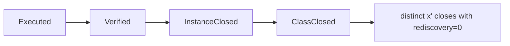

# Definition of Done: Evidentiary Lattice

## Four levels

For recurrent work, v26.9.1 freezes the evidentiary progression:

\[
Executed<Verified<InstanceClosed<ClassClosed.
\]

The symbol `<` denotes stronger standing requirements, not a total order over all possible statuses.

## Executed

A constitutional execution is stronger than the existence of an observed side effect. Under BRCE:

\[
Executed(x)\iff\exists(A_x,R_{a,x})\in\mathcal B(A_{c,x}^*).
\]

An unreceipted side effect does not count as constitutional execution even if the external state changed.

## Verified

Verification adds the bounded acceptance invariant:

\[
Verified(x)\iff Executed(x)\land\mathcal A(K_x)=PASS.
\]

This distinguishes “the command ran” from “the preserved consequence or acceptance condition holds.” External interference or partial realization can cause execution without verification.

## InstanceClosed

Instance closure requires verified execution, valid receipt, terminal state, and replay standing appropriate to the subject:

\[
InstanceClosed(x)\iff Verified(x)\land R_a(x)=VALID\land Terminal(x)\land Replay(x)=PASS.
\]

A terminal refusal can also close a non-success instance when refusal is the lawful expected outcome; the predicate should be parameterized by expected terminal class where necessary.

## ClassClosed

For recurrent class \([x]_\Gamma\), closure requires distinct transfer:

\[
ClassClosed([x]_\Gamma)\iff InstanceClosed(x)\land Encode([x])\land\exists x'\in[x]_\Gamma,\ x'\neq x:\ InstanceClosed(x')\land Rediscovery(x')=0.
\]

This is the strongest ordinary Definition of Done in the frozen constitution because it proves both present completion and elimination of future rediscovery for the bounded class.

## What does not count

A workflow existing is not workflow execution. A pack being generated is not transfer. A test suite passing on mocks is not a world-changing receipt. Documentation of a solution is not class closure. Inspection of a green-looking branch is not exact-head execution evidence.

## Queue consequences

This lattice changes WIP accounting. A recurrent item can be instance-closed yet remain latent WIP if its solution class is expected to recur and has not been encoded and transferred. The relevant inventory is therefore:

\[
WIP^*=WIP_{now}+WIP_{latent}.
\]

Class closure removes the latent recurrence obligation.

