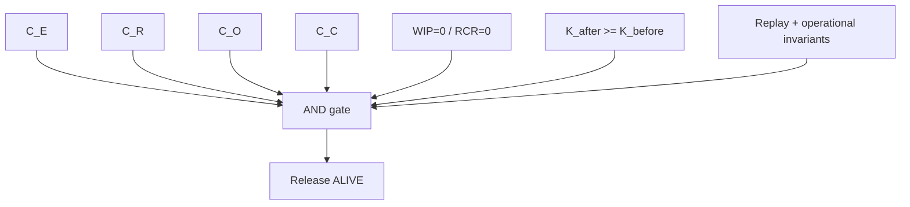

# v26.9.1 Release Theorem

## Product gate

The release is a conjunction of orthogonal standing obligations, not a weighted score.

Let the principal crown receipt family be:

\[
\mathbf R=(R_E,R_R,R_O,R_C,R_W,R_K,R_P).
\]

Then:

\[
Release_{26.9.1}=ALIVE
\]

iff every required receipt and invariant has the standing required by the frozen theorem.

A compact form is:

\[
\bigwedge_{j\in\{E,R,O,C\}}(Closed_j\land Standing_j=ALIVE)
\]

plus the release invariants below.

## Closure invariants

\[
EpistemicClosure=ALIVE
\]

\[
RepresentationalClosure=ALIVE
\]

\[
OperationalClosure=ALIVE
\]

\[
ClassClosure=ALIVE.
\]

Each protects a different constitutional law. One cannot compensate for another.

## WIP invariants

For the admitted release boundary:

\[
WIP_{admitted}=0.
\]

For the bounded semantic crown mutation:

\[
WIP_{representation}=0
\]

and:

\[
RCR_{manual}=0.
\]

These conditions require explicit subject sets. A statement that “there is no WIP” without an admitted inventory is not mechanically meaningful.

## Operational invariants

\[
Forbidden\Rightarrow REFUSED_{preDO}
\]

and:

\[
Permitted\Rightarrow(A,R_a)\in Im(\mathcal B).
\]

Replay must be ALIVE for the required receipt subjects.

## Consequence preservation

The release may not buy apparent compression by degrading the accepted outcome:

\[
K_{after}\succeq K_{before}.
\]

This is essential for constitutional compression experiments. Less work is only a gain if the consequence is preserved or improved under the bounded acceptance relation.

## No scalarization

The following is constitutionally invalid as a release substitute:

\[
\sum_iw_iR_i>threshold.
\]

A perfect representational score cannot compensate for unreceipted actuation. Perfect receipts cannot compensate for candidate state entering canonical truth without admission. Orthogonal conservation laws form a product gate.

## Current status

The specification can be ALIVE as a frozen definition while the release remains:

\[
Release_{26.9.1}=PARTIAL\_ALIVE.
\]

Only execution receipts can change that standing.

