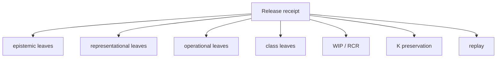

# Crown Receipt Manifest

## Purpose

The Crown Receipt Manifest is the machine-first release ledger for v26.9.1. It converts architectural claims into exact evidence obligations. Narrative descriptions may explain a crown, but they cannot substitute for the leaves of the manifest.

Each receipt entry should bind at least: crown identity, exact subject, admitted base or context, observed input, candidate identity where applicable, evidence, admission outcome, execution or refusal outcome, receipt identity, replay method, acceptance invariant \(K\), and standing.

A useful conceptual record is:

\[
\mathcal R_{26.9.1}=(Identity,Subject,Base,O,O^*,A_c,E,Admission,Outcome,Receipt,Replay,K,Standing).
\]

Not every field applies to every crown; typed absence should be explicit rather than silently omitted.

## Epistemic receipt family

The epistemic manifest records candidate observation, candidate semantic graph, admission context, admitted or refused result, and evidence that no direct candidate-to-canonical path was used.

## Representational receipt family

The representational manifest records the one admitted semantic crown mutation, dependency closure, required projection set, each projection contract, semantic verification, \(R_d\), stale-state checks, contradiction tests, manual synchronization count, and final \(WIP_R\).

## Operational receipt family

The operational manifest binds at least one forbidden exact subject and one permitted exact subject. It records evidence and context showing why the forbidden branch was refused before DO and why the permitted branch was admitted. For the permitted branch it binds \((A,R_a)\).

## Class receipt family

The class manifest records original closed instance \(x\), normalized class identity, reusable structure, distinct \(x'\), evidence that \(x'\in[x]_\Gamma\), execution receipts for \(x'\), and measured rediscovery information.

## Standing discipline

Every leaf must have one of the tagged standings. “Not run,” “probably green,” and “should pass” should normalize to `UNKNOWN` or `PARTIAL_ALIVE`, not ALIVE. `REFUSED` can be the expected terminal standing for an adversarial crown subject while the crown itself is ALIVE.

## Identity

Receipt manifests should use stable content and subject identifiers so a later swarm can distinguish evidence about the exact crown subject from evidence about a nearby branch, earlier commit, different environment, or similar artifact.

## Mechanical gate

The release evaluator should compute a conjunction over required receipt leaves. If a required leaf is absent or nonterminal, release remains `PARTIAL_ALIVE` unless a more precise failure standing applies.

