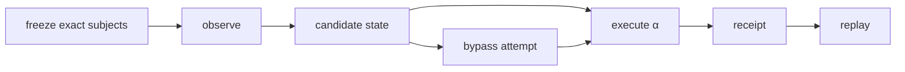

# Epistemic Crown Execution Protocol

## Objective

Execute the frozen epistemic boundary against exact subjects and produce receipts proving that candidate observation never self-promotes into canonical meaning.

## Phase 1: freeze subjects

Select a bounded subject set before execution. Include at least one expected-admit subject and several expected-refusal subjects representing the highest-risk bypass modes: stale data, contradictory data, canonical-looking imported representation, self-generated prior artifact, and contextually invalid historical assertion.

Record each subject's identity and expected standing without modifying the admission implementation after seeing results unless a defect is discovered. This limits post hoc test fitting.

## Phase 2: observe and reconstitute

Produce \(O\) and, where applicable, \(G_O\). Record provenance. Verify that observation transport itself creates no canonical assertion.

Required invariant:

\[
O\neq O^*,\qquad G_O\neq G^*.
\]

## Phase 3: execute admission

Run the exact admission relation under the frozen epistemic context. Capture whether the result is admitted or `REFUSED`, the evidence consumed, the fence/invariants evaluated, and the resulting canonical delta.

## Phase 4: adversarial bypass attempt

Attempt the implementation-specific route most likely to bypass admission: direct store write, reuse of generated canonical serialization, replay of an older admitted object, or a privileged ingestion path. The test is successful when the bypass is impossible or detected and rejected according to the boundary design.

## Phase 5: recursive subject

Use at least one prior operational outcome or refusal as an observation input. Verify that neither successful consequence nor refusal becomes \(O'^*\) without another admission cycle.

## Phase 6: receipt and replay

For each subject, bind observation identity, candidate state, admission context, outcome, canonical delta or refusal, and replay procedure. Replay should verify the original classification from stable evidence.

## Acceptance

The crown is ALIVE only if all expected-admit subjects acquire standing exclusively through admission, all forbidden subjects are lawfully refused, bypass attempts fail, recursive non-self-certification holds, and the exact receipt set is replayable.

Any missing exact execution leaves the crown `PARTIAL_ALIVE`; an absent required admission mechanism is `UNSUPPORTED`; attempted admission defects can be `BUILD_BROKEN`.

