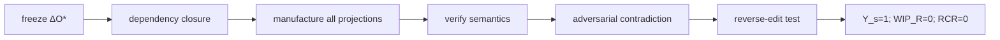

# Representational Crown Execution Protocol

## Objective

Demonstrate semantic manufacturing closure from one admitted semantic mutation across a heterogeneous required projection family with no manual synchronization.

## Phase 1: choose one real semantic mutation

Freeze an admitted semantic change whose consequences span multiple representation classes. A weak change that only updates equivalent configuration files does not sufficiently exercise semantic plurality. Prefer a control or authority semantic that changes machine behavior, tests, policy language, procedure, compliance evidence, and executive explanation.

## Phase 2: derive dependency closure

From \(\Delta O^*\), compute the complete bounded set of affected projection obligations. Record why each projection is in the closure. The required set must be fixed before inspecting generated output so that inconvenient obligations cannot be silently removed.

## Phase 3: manufacture

Generate every required \(T_i\) under its projection contract \(P_i\). Produce \(R_{d,i}\) binding canonical source, selection, grammar/view, invariants, and artifact identity.

## Phase 4: semantic verification

For every projection verify:

\[
s_i\circ\pi_i\cong q_i.
\]

A projection that fails correspondence is `BUILD_BROKEN`. A required projection with no mechanism is `UNSUPPORTED`. External dependency prevents closure with `BLOCKED`.

## Phase 5: adversarial contradiction

Introduce a requested representation that contradicts canonical meaning. The system must refuse publication or produce a semantic build failure. This verifies that manufacture is governed by meaning rather than text completion.

## Phase 6: reverse-edit test

Edit a generated representation so that it implies semantic change. Verify the path:

\[
T_i'\rightarrow\Delta O_c\xrightarrow{admit}O^{*'},
\]

not direct mutation of canonical meaning.

## Phase 7: close WIP

Measure:

\[
Y_s=1,\quad WIP_R=0,\quad RCR_{manual}=0.
\]

No hidden manual rewrite may be used to make the crown look green.

## Acceptance

The crown is ALIVE when all required heterogeneous projections are current and semantically valid, provenance coverage is complete, contradiction handling works, unauthorized reverse mutation is prevented, and closure metrics reach the required values.

