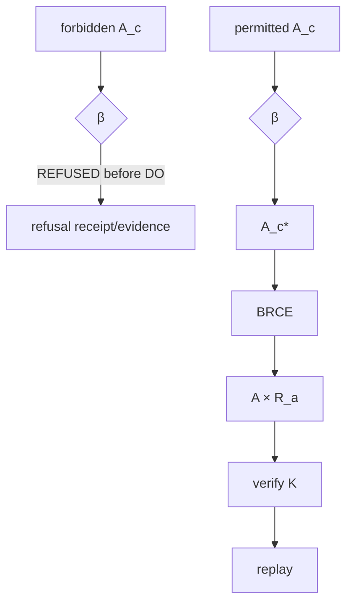

# Operational Crown Execution Protocol

## Objective

Prove the exclusive consequential boundary under both forbidden and permitted subjects and produce exact \(R_a\) standing for the permitted branch.

## Phase 1: choose consequential boundary

Select one real boundary whose actuation has observable consequence. Freeze the environment, subject identities, policy, authority, acceptance invariant \(K\), and temporal context sufficiently to make the expected branch mechanically decidable.

## Phase 2: construct forbidden candidate

Build a technically valid \(A_c\) that lacks one required operational condition. The candidate should be constructible and, ideally, otherwise valid so that rejection demonstrates admission rather than build inability.

Generate evidence \(E\) and execute operational admission. Required result:

\[
Forbidden\Rightarrow REFUSED_{preDO}.
\]

Record evidence that the consequential world was not changed by the refused candidate.

## Phase 3: construct permitted candidate

Build a candidate satisfying the bounded admission conditions. Produce evidence and execute \(eta\). The admitted candidate \(A_c^*\) may then enter BRCE.

Required result:

\[
\mathcal B(A_c^*)=(A,R_a).
\]

## Phase 4: verify consequence

Observe the external environment after DO and evaluate \(K\). A command returning success is insufficient if the accepted consequence did not materialize.

## Phase 5: unreceipted-path attack

Inspect and exercise alternative execution surfaces, error paths, retries, partial failures, and privileged paths for the possibility of successful \(A\) without valid \(R_a\). The crown's structural claim requires the successful unreceipted state to be uninhabited.

## Phase 6: replay

Replay or verify the receipt against subject identity, original context, admission, execution, consequence, and acceptance. Replay need not repeat irreversible DO; it must establish historical standing.

## Phase 7: recursive observation

Feed both refusal and successful consequence into \(\chi\) and prove neither self-promotes into \(O'^*\).

## Acceptance

Operational crown ALIVE requires lawful pre-DO refusal, successful permitted \((A,R_a)\), preserved \(K\), no exposed successful unreceipted route, replay standing, and recursive observation evidence.

