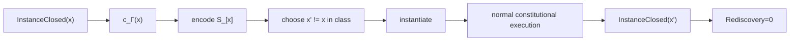

# Class Transfer Crown Execution Protocol

## Objective

Prove that a solved instance has become reusable executable class knowledge by closing a distinct lawful instance without solution rediscovery.

## Phase 1: select original closed instance

The source \(x\) must already be instance-closed with valid execution/verification evidence. A partially solved example cannot seed a class crown.

## Phase 2: normalize class identity

Compute or admit:

\[
c_\Gamma(x)\in\mathcal C
\]

and encode candidate reusable structure \(S_{[x]}\). The structure should contain the ontology, constraints, manufacture rules, verifiers, admission assumptions, receipt requirements, and parameterization necessary for transfer.

## Phase 3: select distinct transfer instance

Choose \(x'\) such that:

\[
x'\neq x
\]

and establish before execution:

\[
x'\in[x]_\Gamma.
\]

The instance should differ materially enough to expose hard-coded details but remain inside the admitted solution class.

## Phase 4: instantiate without solution reconstruction

Instantiate \(S_{[x]}\) with the new observation and context. Record every piece of information introduced by a human, model, script, or operator after instantiation. Distinguish ordinary instance parameters from new solution knowledge.

## Phase 5: execute normal constitution

Class reuse does not bypass admission. The new instance still follows observation, epistemic admission, candidate manufacture, evidence, operational admission, BRCE, receipt, and observation as applicable.

## Phase 6: close the instance

Require:

\[
InstanceClosed(x').
\]

Then evaluate rediscovery information. The crown condition is:

\[
Rediscovery(x')=0.
\]

or equivalently a bounded information measure:

\[
I(x';S_{[x]})=0.
\]

## Phase 7: adversarial transfer

A strong crown also tries an instance near the class boundary. It should either transfer correctly or be classified outside \([x]_\Gamma\) before inappropriate reuse. This tests both undergeneralization and overgeneralization.

## Acceptance

Only after distinct transfer closes without rediscovery does the structure enter class-closed standing and become eligible for accumulation in \(\mathcal S\).

