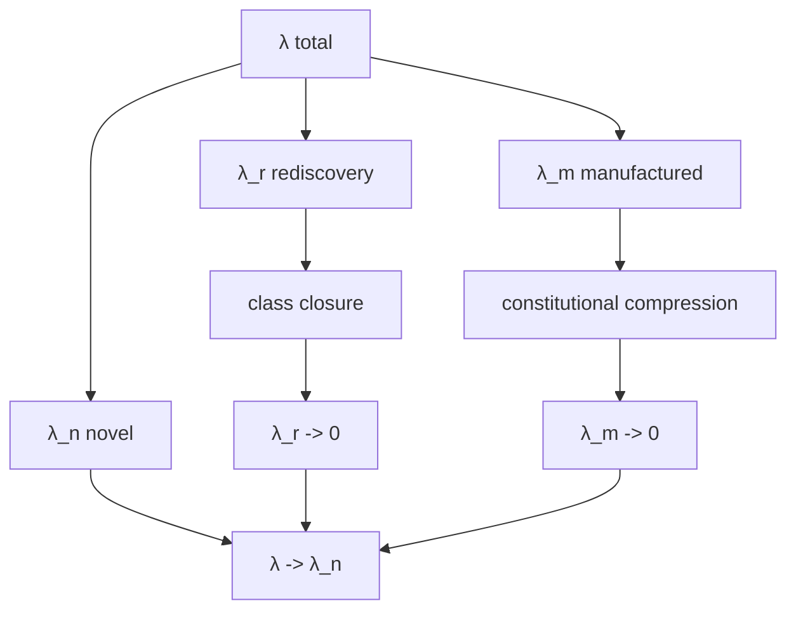

# Little's Law as Work-Generation Control

## Beyond queue acceleration

Little's Law relates average inventory \(L\), arrival rate \(\lambda\), and average lead time \(W\):

\[
L=\lambda W.
\]

A conventional improvement program often focuses on reducing \(W\): execute work faster. v26.9.1 asks a prior constitutional question: why does the arrival exist at all?

Decompose:

\[
\lambda=\lambda_n+\lambda_r+\lambda_m.
\]

Here \(\lambda_n\) represents work caused by genuinely new observations or problems. \(\lambda_r\) represents rediscovery of classes already solved. \(\lambda_m\) represents work manufactured by defective constitutional structure.

## Novel arrivals

The system does not target:

\[
\lambda_n\rightarrow0.
\]

Reality continues to change. Novel observation is how the recursive calculus advances. There is no residual mechanism beyond the constitution; novelty enters \(O\), receives admission if warranted, and moves through the same lawful manufacture relation.

## Rediscovery arrivals

Class closure attacks:

\[
\lambda_r\rightarrow0.
\]

When a solved recurring structure is encoded, verified, transferred to a distinct instance, and accumulated, the next member of the class should require instantiation rather than rediscovery.

## Manufactured arrivals

Constitutional compression attacks:

\[
\lambda_m\rightarrow0.
\]

Examples include duplicate semantic synchronization, unnecessary approval discovery, retrospective evidence reconstruction, invalid-state recovery, coordination queues, rework caused by contradictions, and repeated manual transcription.

The strongest improvement order is:

\[
Elimination\succ Automation\succ Acceleration.
\]

If work is unnecessary under a better constitution preserving \(K\), automating it preserves manufactured demand.

## Ideal asymptote

The desired limit is:

\[
\lambda\rightarrow\lambda_n.
\]

Work increasingly arrives because reality actually changed, not because the institution forgot what it already solved or generated compensatory labor through its own design.

## WIP inventory

Current open work is not the only inventory. Recurrent solved instances whose class solution remains uncaptured create latent future arrivals. A useful concept is:

\[
WIP^*=WIP_{now}+WIP_{latent}.
\]

Instance closure drains current inventory. Class closure reduces the future arrival process.

