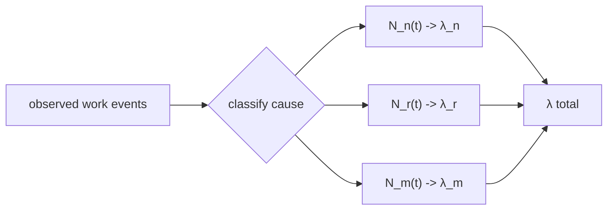

# Work-Arrival Measure

## Separate measures from class indices

The symbol \(\Lambda\) is reserved for work-arrival measure and must not be reused for the class identity index set. Civilization memory uses \(\mathcal I_t\); work generation uses counting processes and intensities.

Define counting processes:

\[
N_n(t),\quad N_r(t),\quad N_m(t),
\]

for novel, rediscovery, and manufactured work arrivals.

Their intensities are:

\[
\lambda_j(t)=\frac{d}{dt}\mathbb E[N_j(t)],\qquad j\in\{n,r,m\}.
\]

The total intensity is:

\[
\lambda(t)=\lambda_n(t)+\lambda_r(t)+\lambda_m(t).
\]

## Dimensional discipline

Arrival intensity has units of events per unit time. It must not be equated with entropy or unresolved information. A high-rate stream of trivial events and a low-rate stream of extremely difficult novel events can have the same arrival count but radically different information burden.

This is why v26.9.1 maintains a separate information-theoretic model.

## Classification

An arrival should be classified by the source of required work, not merely by the surface that reported it. A bug can be novel, rediscovery, or manufactured. A policy review can be genuinely new because the law changed, rediscovery because the same rule was forgotten, or manufactured because duplicated representations drifted.

Classification therefore requires admitted context and class knowledge.

## Rediscovery intensity

A class-closed solution should progressively remove events from the rediscovery process. The strongest evidence is not a modeled forecast but observed distinct instances that instantiate existing structure without solution rediscovery.

## Manufactured intensity

Constitutional interventions should be evaluated against a baseline with preserved consequence. If an intervention removes repeated coordination, transcription, authority discovery, or rework while \(K\) remains preserved, the observed difference gives evidence for removable manufactured demand.

## Statistical caution

The asymptotic notation:

\[
\lambda_r\rightarrow0,\qquad\lambda_m\rightarrow0
\]

is a design target, not an assertion that finite empirical systems literally reach zero under every disturbance. Measurements should state time window, admission boundary, event definition, confidence, and contextual changes.

## Relationship to Little's Law

Once the arrival classes are separately measurable, Little's Law can be applied to their resulting inventories and lead times. This allows the system to distinguish faster processing from reduced work generation.

