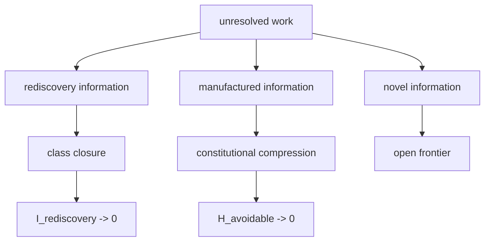

# Information-Theoretic Post-AGI Form

## Arrival rate is not information

The work-arrival field and the information burden must remain dimensionally distinct. The intensity \(\lambda_j\) counts arrivals per unit time. Entropy or conditional information measures unresolved uncertainty associated with those arrivals. Equating them would make the formal model dimensionally incoherent.

Let \(N\), \(R\), and \(M\) denote novel, rediscovery, and constitution-manufactured unresolved information classes. Define avoidable unresolved information as:

\[
H_{avoidable}=H(R,M\mid O^*,\mathcal S,\Gamma).
\]

Define novel unresolved information as:

\[
H_{novel}=H(N\mid O^*,\mathcal S,\Gamma).
\]

The post-AGI information target is:

\[
H_{avoidable}\rightarrow0.
\]

The residual unresolved information tends toward:

\[
H_{work}\rightarrow H_{novel}.
\]

## No independence assumption

A simple equation such as \(H_{work}=H_n+H_r+H_m\) would require assumptions about independence. The conditional formulation avoids carrying that unnecessary claim. If a chain-rule decomposition is needed, it should be written explicitly with conditional terms.

## Rediscovery information

For a class transfer \(x'\), let \(I(x';S_{[x]})\) denote new solution information introduced after instantiation of the class structure. Class closure requires:

\[
I(x';S_{[x]})=0.
\]

This does not require zero new instance data. New observations, parameter values, and context are allowed. What must disappear is the need to reconstruct the solution rule already captured by the class.

## Manufactured information

Institutional systems create avoidable uncertainty through duplicated representations, unclear authority, retrospective evidence search, ambiguous handoffs, invalid intermediate states, and undocumented constraints. Constitutional compression aims to move these from unresolved cognition into explicit standing, factorization, and reusable structure.

## Intelligence is not the objective variable

The post-AGI objective is not:

\[
Intelligence\rightarrow\infty.
\]

It is closer to:

\[
RepeatedNeedForIntelligence\rightarrow0
\]

for already absorbed classes, while genuinely novel reality continues to supply new information.

This reframes automation. The ideal system does not repeatedly summon stronger cognition to reconcile a defective world model. It changes the constitution so that solved structure is represented, admitted, manufactured, receipted, and accumulated.

## Coupled asymptote

The work and information targets can be written together:

\[
(\lambda_r,\lambda_m,H_{avoidable})\rightarrow(0,0,0),
\]

while:

\[
\lambda_n\ge0,\qquad H_{novel}\ge0
\]

remain open to reality.

