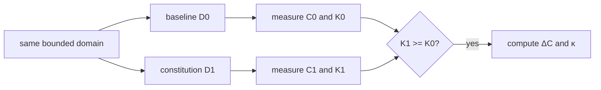

# Constitutional Compression

## Observed complexity decomposition

A central research hypothesis of v26.9.1 is that observed operational complexity contains both intrinsic and constitution-manufactured terms:

\[
C_{observed}=C_i+C_r+C_c+C_a+C_v+C_f.
\]

Here \(C_i\) denotes intrinsic complexity of the bounded consequence, \(C_r\) representational/transcription complexity, \(C_c\) coordination and waiting complexity, \(C_a\) authority discovery and routing complexity, \(C_v\) retrospective verification and evidence reconstruction, and \(C_f\) failure, rework, rollback, and incident complexity.

The manufactured component is:

\[
C_m=C_r+C_c+C_a+C_v+C_f.
\]

The constitution does not claim \(C_i\) is directly known.

## Experimental design

Compression should be demonstrated through controlled comparison:

\[
SameDomain\times SameInitialState\times DifferentConstitution.
\]

Let \(D_0\) be baseline constitution and \(D_1\) the Chatman constitutional treatment. Comparison is valid only if the accepted consequence is preserved:

\[
K_1\succeq K_0.
\]

Otherwise the system could appear simpler merely by doing less of the required work.

## Compression ratio

A bounded operational compression metric is:

\[
\kappa=1-\frac{C(D_1)}{C(D_0)}.
\]

Different studies can define lifecycle, marginal, or operational cost functions as long as dimensions are explicit. Platform construction cost must be included where relevant so complexity is not merely relocated out of the observed boundary.

## Empirical lower bound

Because \(C_i\) is not directly identified, intervention evidence should make a weaker but defensible claim:

\[
C_{removable}\ge C(D_0)-C(D_1)
\]

when the treatment preserves \(K\). The observed reduction establishes at least that much removable complexity in the baseline.

## Cognitive intervention ratio

One useful companion metric is:

\[
\rho=\frac{unstructured\ human\ interventions}{completed\ lawful\ transitions}.
\]

The target is \(
ho\downarrow\), especially for recurrent classes. This measures removal of compensatory cognition without claiming that all cognition is reducible.

## Governing order

The treatment hierarchy is:

\[
Elimination\succ Automation\succ Acceleration,
\]

subject to \(K\) preservation. Eliminate work whose necessity disappears under a better constitution before automating it.

## Research significance

Constitutional compression turns “complexity” from a rhetorical complaint into an intervention target. The stronger scientific object is manufactured complexity: work and unresolved information removable by changing representation, standing, authority topology, verification, and class accumulation while preserving consequence.

