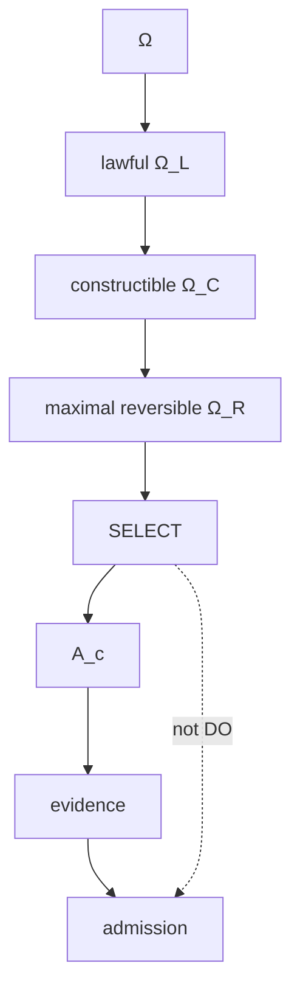

# DfCM and Combinatorial Maximalism

## Construction space

Let \(\Omega(O^*)\) be the candidate possibility space induced by admitted meaning and context. The constitution distinguishes preservation of lawful reversible possibility from premature selection of a single candidate.

A naïve objective such as:

\[
\max|\Omega_{reversible}|
\]

is unsafe for infinite spaces because strict subsets can share cardinality. The correct order is set inclusion.

Define:

\[
\mathscr R=\{X\subseteq\Omega:X\subseteq\Omega_L\cap\Omega_C\land Reversible(X)\}.
\]

Then choose:

\[
\Omega_R\in Max_{\subseteq}(\mathscr R),
\]

meaning:

\[
\nexists X\in\mathscr R:\Omega_R\subsetneq X.
\]

No additional lawful reversible possibility can be preserved without violating the defined family.

## DfCM principle

The governing intuition is to preserve maximum lawful reversible optionality before irreversible commitment. This is not indecision. It is an information-preservation strategy: do not destroy possibilities earlier than the constraints require.

Only after the reversible frontier is established does selection manufacture a candidate:

\[
SELECT:\Omega_R\rightarrow A_c.
\]

Still:

\[
SELECT\neq DO.
\]

## Relationship to authority

Authorization need not shrink the construction space prematurely if construction itself is nonconsequential. A system can explore many technically lawful possibilities while reserving operational authority for the later admission boundary. This is one of the advantages of strict CONSTRUCT/DO separation.

## Search and simulation

Search, simulation, adversarial evaluation, optimization, and planning can operate over \(\Omega_R\) without ambient actuation authority. Their outputs are evidence or candidates. This lets post-AGI systems reason broadly without making the search process itself consequential.

## Failure modes

Prematurely selecting one path can manufacture work by causing rework when later constraints emerge. Conversely, preserving options outside lawful or constructible bounds wastes search capacity. DfCM is therefore bounded maximalism, not unconstrained enumeration.

## Crown relevance

DfCM does not directly make release ALIVE. Its output is candidate manufacture. Its value is demonstrated when the resulting candidates improve consequence preservation, reduce rework, or enable class transfer while the constitutional admission and receipt boundaries remain intact.

