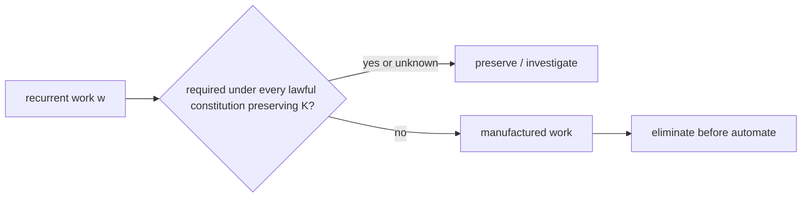

# The Work Necessity Test

## Question before automation

For recurrent work \(w\), define the governing question:

**Is \(w\) necessary under every lawful constitution that preserves the accepted consequence \(K\) within boundary \(B\)?**

If not, \(w\) is constitution-manufactured and is a candidate for elimination rather than automation.

A conceptual predicate is:

\[
Necessary(w;K,B)\iff\forall\mathfrak C'\in LawfulConstitutions(K,B):Required_{\mathfrak C'}(w).
\]

If the predicate fails, there exists a lawful constitution preserving \(K\) in which the work is unnecessary.

## Examples of manufactured work

Manual synchronization of code and policy can disappear when both are projections from admitted semantics. Repeated approval discovery can disappear when authority is explicit and machine-addressable. Retrospective audit evidence assembly can disappear when consequence is receipted structurally. Repeated solution reasoning can disappear when class closure transfers executable knowledge. Invalid-state recovery can disappear when the state is uninhabited by type.

The important point is not that these examples are always removable. The test is empirical and bounded.

## Chesterton's fence

Before removing work, preserve the reason it exists. A task may be compensating for an unstated invariant, regulatory requirement, safety control, social coordination need, or physical uncertainty. The correct sequence is:

\[
Preserve\rightarrow Fence\rightarrow Model\rightarrow Test\rightarrow Eliminate.
\]

Removing a task without identifying the consequence it protects can degrade \(K\) and create false compression.

## Elimination versus automation

The governing order is:

\[
Elimination\succ Automation\succ Acceleration.
\]

Automating unnecessary work increases throughput of manufactured demand. Acceleration alone can increase WIP if arrival generation rises faster than completion.

## Relation to lambda decomposition

The Work Necessity Test is a classifier for \(\lambda_m\). If a recurring arrival disappears under a lawful constitution preserving \(K\), it belongs to constitution-manufactured demand rather than intrinsic novelty.

Class closure addresses a different case: work that was once genuinely necessary to solve but should not recur as rediscovery after the solution class is absorbed.

## Evidence

A strong necessity claim uses interventions, not opinion. Compare baseline and constitutional treatments with preserved acceptance. If the work disappears and consequence remains, the experiment demonstrates removability within the tested boundary.

