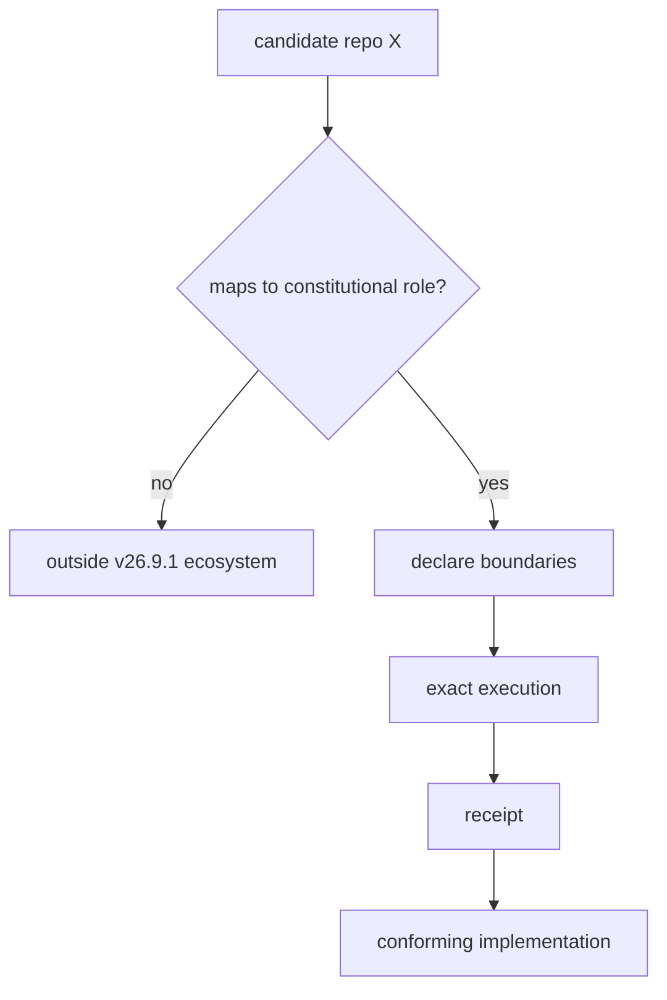

# Repository Governance and Anti-Sprawl

## Repo is not architecture

The constitutional ecosystem is not the set of repositories bearing related names. Repository topology is an implementation detail. The governing relation is:

\[
Repo\not\equiv Architecture.
\]

A repository earns ecosystem standing by implementing a required constitutional object, morphism, evidence function, boundary, receipt function, replay mechanism, or class-closure capability.

## Anti-sprawl test

For a repository \(X\), define a role mapping into the constitutional role space. If no lawful mapping exists:

\[
Role(X)=\varnothing\Rightarrow X\notin\mathcal E_{26.9.1}.
\]

Useful functionality alone is not sufficient. The question is why the calculus requires that implementation surface.

## Primary responsibility

An implementation may expose several compatible capabilities, but it should declare one primary constitutional responsibility at its ecosystem boundary. This keeps authority topology understandable and prevents a “utility” component from silently accumulating observation, admission, manufacture, and actuation powers.

## Boundary declaration

Every repository-level conformance document should answer four questions:

1. Which constitutional sort or morphism does the component implement?
2. Which transitions is it explicitly forbidden to perform?
3. What exact execution demonstrates its claimed role?
4. Where is the receipt proving that execution?

This turns architecture review from feature inventory into typed conformance.

## No implementation-driven constitutional mutation

After the freeze, a repository discovering a convenient shortcut is not evidence that the calculus should expand. The implementation should conform unless execution reveals an actual type contradiction or a lawful consequential requirement that cannot factor through the frozen boundaries.

Only an observed falsifier can reopen architecture or mathematics.

## Dependency direction

The constitutional source-of-truth repository is logically above implementations in governance but need not be a runtime dependency. Components conform to the specification; the specification is not defined by importing their code.

## Lifecycle

Repositories may split, merge, be rewritten, archived, or replaced. If the same constitutional role continues to be implemented with equivalent evidence, architecture remains unchanged. This is the practical meaning of implementation-independent design.

## WIP implication

Creating another repository creates new coordination and maintenance inventory. The anti-sprawl rule therefore aligns with Little's Law: a new implementation surface must justify the future work it introduces by a missing constitutional need or a demonstrable improvement preserving \(K\).

