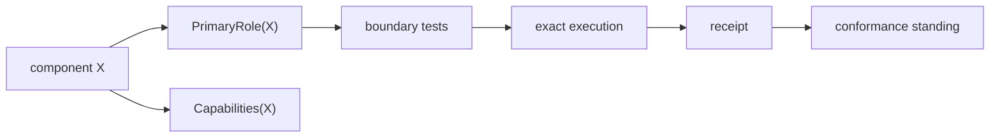

# Component Role Calculus

## Role space

A practical constitutional role set is:

\[
\mathcal R=\{Observe,CandidateState,SemanticState,Construct,Project,ProduceEvidence,Admit,Actuate,Receipt,Replay,ClassClose\}.
\]

These labels describe ecosystem boundaries rather than internal implementation details.

## Primary role

Because some legitimate components span closely coupled capabilities, requiring exactly one total role is too strong. Instead define:

\[
PrimaryRole(X)\in\mathcal R
\]

with exactly one declared primary responsibility, and:

\[
Capabilities(X)\subseteq\mathcal R.
\]

A consequential boundary can therefore have a primary actuation-boundary role while exposing admission, actuation, and receipt capabilities without pretending those functions are identical.

## Conformance

A role declaration is not self-proving. For component \(X\), conformance should bind:

\[
Conforms(X)=RoleDeclaration\land BoundaryTests\land ExactExecution\land Receipt.
\]

The tests should include negative transitions. A projection component demonstrates not only that it can manufacture representations but that it cannot directly mutate canonical semantic standing. An evidence producer demonstrates it cannot confer operational authority.

## Capability compatibility

Certain capability combinations demand scrutiny. Observe + Admit can collapse candidate state into truth if interfaces are not distinct. ProduceEvidence + Admit can collapse proof into authority. Construct + Actuate can collapse candidate manufacture into DO. Project + SemanticState can allow text mutation to alter canonical meaning. These combinations are not automatically forbidden, but the mandatory factorization must remain visible and enforceable.

## Role evolution

A component can change implementation or add internal features without changing its constitutional role. If it begins exposing a new constitutional boundary, the role registry and conformance evidence should change explicitly rather than allowing authority expansion to occur implicitly.

## Registry

The ecosystem should maintain a machine-readable component registry containing component identity, primary role, secondary capabilities, owned interfaces, forbidden transitions, receipt locations, exact-head conformance standing, and class-closure status where applicable.

## Anti-sprawl relation

If no role or required supporting surface can be identified:

\[
Role(X)=\varnothing.
\]

The component should not be treated as constitutional ecosystem scope. This keeps the frozen architecture from expanding to mirror every useful repository.

