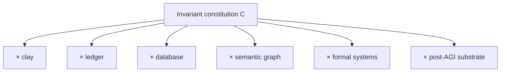

# Substrate Invariance: From Clay Tokens to Receipted Computation

## Calculus times substrate

The constitutional history is not modeled as one obsolete architecture being replaced by a modern architecture. It is modeled as an invariant calculus realized over changing substrates:

\[
\mathfrak C\times Substrate_t.
\]

Representative substrates include clay tokens and sealed envelopes, writing, ledgers, databases, semantic graphs, generated representations, formal proof systems, deterministic capability surfaces, and receipted machine actuation.

The invariant is:

\[
O\rightarrow O^*\xrightarrow{\mu}(A,R)\rightarrow O'.
\]

## Clay as witness

A physical accounting token can embody the same distinctions in primitive form: observed commodity or obligation, admitted account representation, manufactured token or sealed account, and durable evidence of standing. The historical substrate lacks modern expressive power, but it witnesses the recurring need to distinguish raw reality, admitted representation, transformation, and durable receipt.

The claim is not that ancient accounting implemented the complete v26.9.1 software architecture. It is that the constitutional pattern does not depend on software.

## What substrate evolution changes

Substrates can increase expressiveness, reproducibility, queryability, composability, speed, formal verification, replayability, and authority precision. They can reduce transcription and coordination burden. They can make previously tacit fences mechanically enforceable.

None of those improvements requires the core distinctions to collapse.

## Semantic printing versus copying

Printing reduced the marginal cost of reproducing one composed representation. Semantic manufacturing aims at a different transformation: one admitted semantic structure produces many purpose-specific lawful representations. The analogy is useful only if the distinction between copying and derivation remains explicit.

## Substrate replacement

A graph store can be replaced without changing epistemic admission. A theorem prover can be replaced without changing `Proof != Authority`. An actuator can be replaced without changing BRCE's product codomain. A receipt hash can be replaced without collapsing \(R_d\) and \(R_a\).

This provides a migration test: if replacing an implementation substrate requires redefining the constitutional primitive, either the old implementation had leaked into architecture or an actual falsifier has been discovered.

## Post-AGI implication

AGI is also a substrate/capability phenomenon inside the calculus, not an external mechanism. A more capable manufacturer changes what can be constructed from \(O^*\); it does not gain ambient admission or actuation authority by intelligence alone.

