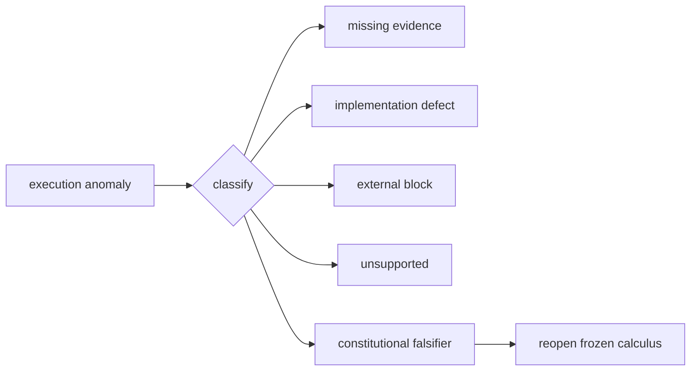

# Falsification and the Adversarial Research Program

## Freeze does not mean dogma

Architecture and mathematics are frozen against ordinary implementation-driven elaboration, not against evidence. A freeze means new prose cannot silently mutate the calculus. A legitimate reopening requires observed evidence that the formal object cannot type a lawful requirement or that a claimed conservation law fails under execution.

## Constitutional falsifiers

Examples capable of reopening the core include:

1. a lawful successful consequential transition that cannot factor through the modeled admission/BRCE structure without introducing an irreducible new primitive;
2. an unavoidable successful actuation state in which consequence exists but no receipt can inhabit the same constitutional outcome;
3. a type contradiction showing that two supposedly distinct standing sorts must be identical for lawful execution;
4. recursive observation requiring a direct consequence-to-admitted-truth coercion rather than observation and admission;
5. a class-transfer result demonstrating that the formal class relation cannot represent a necessary reuse boundary even after contextual refinement.

Implementation inconvenience, latency, code duplication, or repository layout are not falsifiers by themselves.

## Adversarial experiments

Every crown should include negative tests designed to defeat the constitutional claim. The epistemic crown tries to smuggle candidate state into canonical meaning. The representational crown introduces contradiction and reverse-edit escalation. The operational crown attempts forbidden actuation and successful unreceipted paths. The class crown selects distinct and boundary-adjacent transfer instances to expose overfitting.

## Standing of failed experiments

A failed crown does not automatically falsify the constitution. It can identify implementation defect, missing mechanism, unsupported capability, external block, or inadequate class encoding. The first classification task is therefore:

\[
\{missing\ evidence,missing\ implementation,implementation\ defect,external\ block,constitutional\ falsifier\}.
\]

Only the final category reopens frozen primitives.

## Minimality tests

Because the calculus is intended to be irreducible, research should also test whether any primitive can be removed without collapsing a standing distinction. If observation and admission can be safely identified, or receipt can be removed without creating an unbounded successful state, the claimed minimality would be weakened.

## Non-vacuity

Mandatory factorization must not become true merely because “lawful” is defined circularly as “whatever follows the factors.” Domain acceptance and external consequence provide independent pressure. The system must show useful consequential work under the restrictions.

## Research posture

The strongest continuation is execution-first adversarial science: freeze the theorem, choose exact subjects, try to break it, receipt outcomes, refine implementation, and change the constitution only when evidence forces it.

