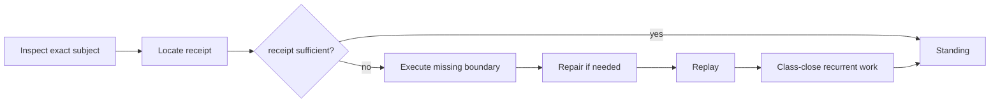

# Post-AGI Swarm Execution Protocol

## Purpose

After the v26.9.1 constitutional freeze, swarms should optimize evidence acquisition rather than architectural ideation. The governing loop is:

\[
Inspect\rightarrow LocateReceipt\rightarrow ExecuteMissingBoundary\rightarrow Repair\rightarrow Replay\rightarrow ClassClose.
\]

A worker that cannot identify how its activity advances an exact crown receipt is probably manufacturing WIP.

## Step 1: resolve exact subject

Never report standing about “the project” when the required claim concerns an exact branch, semantic mutation, candidate action, receipt, workflow state, or transfer instance. Resolve identity first.

## Step 2: observe before inferring

Inspect the current subject, receipts, admitted state, and acceptance conditions. Preserve the distinction between observed, inferred, unsupported, refused, blocked, and executed.

A swarm must not convert absence of evidence into `UNSUPPORTED`, or a failed build into `REFUSED`.

## Step 3: locate existing receipts

Before creating new work, search for standing evidence. A valid existing receipt may close the obligation. If the receipt refers to a different commit, context, subject, or projection version, it does not automatically transfer standing.

## Step 4: execute the narrowest missing boundary

If evidence is missing, execute the smallest lawful experiment that can change standing. Do not create a new framework when one exact crown subject can be run. Do not expand the ontology merely to explain a build defect.

## Step 5: repair by standing type

`BUILD_BROKEN` calls for implementation repair. `BLOCKED` calls for prerequisite resolution. `UNSUPPORTED` calls for mechanism creation or a scoped refusal of the requirement. `REFUSED` may be the correct terminal state. `UNKNOWN` calls for observation or evidence acquisition.

## Step 6: replay exact head or exact subject

After repair, verify the actual changed subject rather than relying on a prior green run. Receipt identity should bind the execution to the exact version whose standing is being claimed.

## Step 7: class-close recurrent repairs

A repeated failure repaired once is not necessarily complete. If the same class is expected to recur, encode the solution, verify it, and transfer it to a distinct lawful instance. This is how the swarm prevents tomorrow's copy of today's WIP.

## Freeze rule

Architecture or mathematics may be reopened only if execution yields an observed type contradiction or failed mandatory factorization that cannot be resolved by implementation, context, class refinement, or evidence.

## Worker output

Every bounded worker should emit: exact subject, observations, actions actually executed, receipt references, acceptance result, standing tag, unresolved dependencies, and whether the class has been closed.

The final question remains:

\[
\boxed{Where\ is\ the\ exact\ receipt?}
\]

