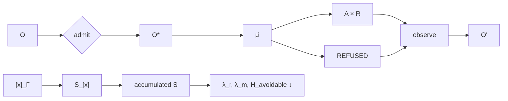

# Maximum Compression and Immutable Kernel

## Frozen status

\[
Architecture_{26.9.1}=FROZEN
\]

\[
Mathematics_{26.9.1}=FROZEN
\]

\[
Release_{26.9.1}=PARTIAL\_ALIVE.
\]

The first two standings describe specification closure. The third remains evidentiary and can change only through crown execution.

## Constitutional context

Define:

\[
\Xi_t=(\Theta_t,\Pi_t,B_t,K_t,\tau_t)
\]

and:

\[
\Gamma_t=O_t^*\times\Xi_t.
\]

Candidate manufacture:

\[
\mu_c:\Gamma_t\rightarrow A_c.
\]

Evidence:

\[
\nu:\Gamma_t\times A_c\rightarrow E.
\]

Operational admission:

\[
\beta:\Gamma_t\times A_c\times E\rightarrow A_c^*\sqcup REFUSED.
\]

BRCE:

\[
\mathcal B:A_c^*\rightarrow A\times R_a.
\]

Lifted constitutional manufacture:

\[
\widehat\mu_t:\Gamma_t\rightarrow(A\times R_a)\sqcup REFUSED.
\]

Recursive observation:

\[
\chi_t:((A\times R_a)\sqcup REFUSED)\times\mathbb W_{t+1}\rightarrow O_{t+1}.
\]

Then:

\[
O_{t+1}\xrightarrow{\alpha_{t+1}}O_{t+1}^*.
\]

## Maximum recursion

\[
\boxed{O_t\xrightarrow{\alpha_t}O_t^*\xrightarrow{\widehat\mu_t}(A_t\times R_t)\sqcup REFUSED\xrightarrow{\chi_t}O_{t+1}.}
\]

The familiar quotient remains:

\[
\boxed{A=\mu(O^*).}
\]

## Accumulation

Define contextual class quotient:

\[
x\sim_\Gamma y\iff c_\Gamma(x)=c_\Gamma(y).
\]

Then:

\[
\boxed{[x]_\Gamma\xrightarrow{ClassClose}S_{[x]}\rightarrow\mathcal S.}
\]

Class closure requires a distinct transfer instance with zero rediscovery information.

## Asymptotic field

\[
\lambda=\lambda_n+\lambda_r+\lambda_m,
\]

with:

\[
\lambda_r\rightarrow0,\qquad\lambda_m\rightarrow0,
\]

and:

\[
H_{avoidable}=H(R,M\mid O^*,\mathcal S,\Gamma)\rightarrow0.
\]

Reality remains open through \(\lambda_n\) and \(H_{novel}\).

## Three laws

\[
\boxed{候不自准}
\]

No candidate self-promotes into standing.

\[
\boxed{行不越憲}
\]

No consequential morphism bypasses mandatory lawful factorization.

\[
\boxed{解不復疑}
\]

No class-closed solution returns as discovery absent falsification or contextual failure of applicability.

## Final doctrine

Observe without granting standing. Admit meaning explicitly. Preserve maximal lawful reversible possibility. Construct without authority. Produce evidence without confusing proof with permission. Admit consequential intent explicitly. Actuate only through a boundary whose successful codomain includes the receipt. Observe success and refusal anew. Accumulate only solutions proven transferable to distinct lawful instances. Eliminate rediscovery and constitution-manufactured work while leaving genuinely new reality open.

No further architecture prose can raise release standing. The remaining morphism is evidence:

\[
Specification\xrightarrow{execute}Receipt\xrightarrow{replay}Standing.
\]

Everything else is WIP unless execution discovers a genuine falsifier.

