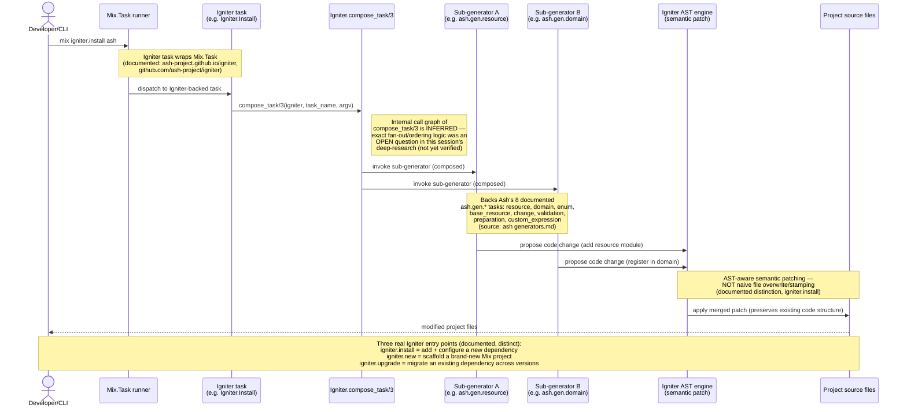
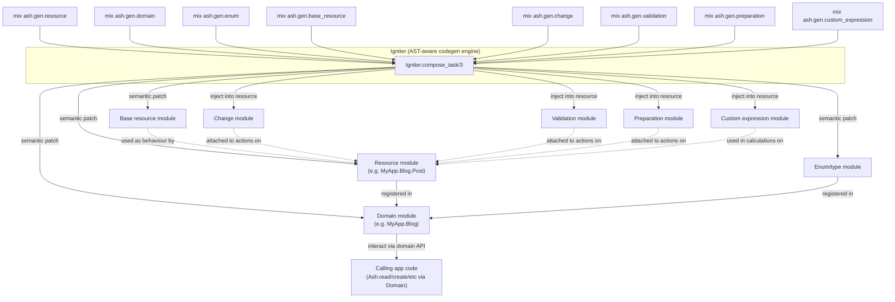
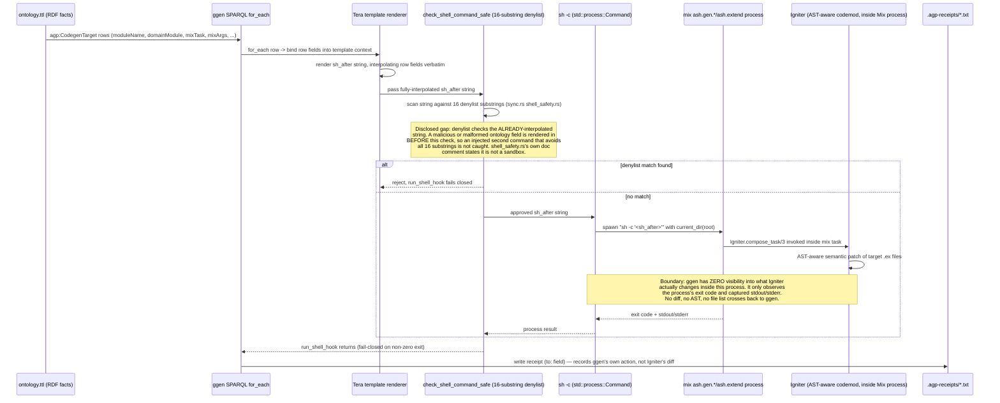
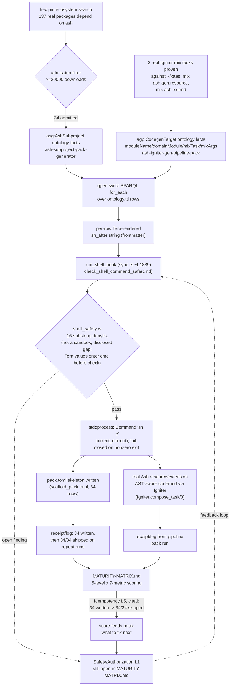

# ggen ↔ Igniter ↔ Ash: Real Pipeline Diagrams

These four diagrams are grounded in this session's real, verified work: a real source-code
audit of ggen-engine's `sync.rs` (`run_shell_hook`, ~line 1839) and `shell_safety.rs` (16-substring
denylist, self-documented as "not a sandbox"); real deep-research on Igniter/Ash with cited
sources (ash-project.github.io/igniter, github.com/ash-project/igniter, Ash's
`generators.md` doc); the real artifacts `ash-igniter-gen-pipeline-pack` and
`ash-subproject-pack-generator`; and the real `MATURITY-MATRIX.md` 5-level×7-metric scoring
(including the cited Idempotency L5 evidence of 34 written → 34/34 skipped on repeat runs,
and the still-open Safety/Authorization L1 finding). Each diagram's caption states exactly
which edges are documented/verified versus inferred/open, matching how they were drafted.

## 1. Igniter internals

This diagram traces Igniter's generator-composition flow for `mix igniter.install ash` — CLI
invocation through `Mix.Task` wrapping, `Igniter.compose_task/3` fan-out to sub-generators, and
AST-aware semantic patching — sourced from this session's deep-research citations
(ash-project.github.io/igniter, github.com/ash-project/igniter, Ash's `generators.md` doc). It
also distinguishes the three real entry tasks (`igniter.install` / `igniter.new` /
`igniter.upgrade`) per that same documentation.

## 2. Ash's `ash.gen.*` family

This diagram reflects only the real, documented mechanics established this session: Igniter's
`Igniter.compose_task/3` composition point wraps `Mix.Task` and performs AST-aware (not
file-stamping) codegen, per ash-project.github.io/igniter and github.com/ash-project/igniter;
the 8 `ash.gen.*` tasks are the ones documented in
github.com/ash-project/ash/documentation/topics/development/generators.md; and the "resources
are tied together by a domain module used to interact with them" relationship is the
deep-research's stated fact, not invented. The finer edges (e.g. exactly which AST insertion
points each generator targets, whether `base_resource`/`change`/`validation`/`preparation`/
`custom_expression` write new files vs. patch existing ones) are not yet verified this session
and are shown only at the level of granularity the research actually confirmed.

## 3. The ggen ↔ Igniter bridge (the safety-relevant one)

This sequence is grounded in
`~/chatman-ecosystem/platform-console/services/ggen/ggen-src/crates/ggen-engine/src/sync.rs`
(`run_shell_hook`, ~line 1839) and `shell_safety.rs` (16-substring denylist, self-documented as
"not a sandbox"), plus the frontmatter chain `sparql:` → `for_each:` → per-row Tera-rendered
`sh_after` → `run_shell_hook`. The safety-critical detail is that the denylist inspects the
string only after Tera has already interpolated ontology row values into it — a crafted field
can inject a second shell command that never matches any of the 16 substrings, and this is a
real disclosed gap, not a hypothetical. Equally important: once `sh -c` spawns the
`mix ash.gen.*`/`mix ash.extend` process, Igniter's AST-aware codemod happens entirely inside
that child process — ggen observes only the exit code and stdout/stderr, never the actual file
diff, and the receipt it writes to `.agp-receipts/*.txt` documents that ggen ran the hook, not
what Igniter changed.

## 4. The full end-to-end pipeline

This traces the one real, already-built pipeline: hex.pm's 137-package ash-ecosystem search
admits 34 packages (≥20000 downloads) into `asg:AshSubproject` facts, in parallel with
`agp:CodegenTarget` facts proven against 2 real Igniter mix tasks in `~/xaas`, both consumed by
the same real ggen sync mechanism (SPARQL `for_each` → Tera `sh_after` → `run_shell_hook` in
`sync.rs`). That hook's 16-substring denylist (`shell_safety.rs`, explicitly "not a sandbox")
gates a real `sh -c` spawn — for the subproject pack, `pack.toml` skeletons written idempotently
(34 written, then 34/34 skipped on repeat runs, per the real receipt log); for the pipeline
pack, real AST-aware Igniter codemods against Ash resources/extensions. Both write receipt/log
evidence back into `MATURITY-MATRIX.md`'s 5-level×7-metric scoring — the cited Idempotency L5
example is real — and that scoring closes the loop by feeding back into what needs fixing next,
including the still-open Safety/Authorization L1 finding tied to the denylist's disclosed
shell-injection gap.
