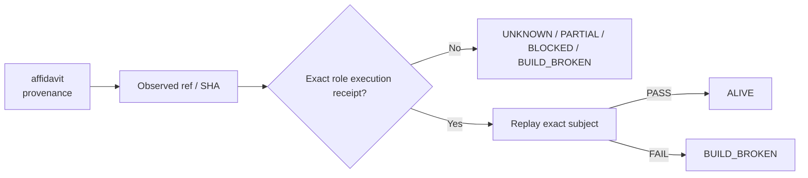

# affidavit — Ecosystem Status Report

> **Generated projection.** This file's facts (ref, SHA, standing, receipts) are rendered from `status/snapshot.json`, the single machine-generated source of truth. Do not hand-edit facts here; regenerate from `status/snapshot.json` instead (AGENTS.md rule 6: generated files are projections, not canonical sources).

> **Observed:** `2026-08-16T02:32:03.164547+00:00`  
> **Repository:** `seanchatmangpt/affidavit`  
> **Constitutional role:** `provenance`  
> **Current evidence standing:** `ALIVE`

## Executive status

| Field | Observation |
|---|---|
| Required | `true` |
| Disposition | `REQUIRED` |
| Configured ref | `feat/ecosystem-standing-receipts-20260812` |
| Current SHA | `5dc78f113e60ba95a4b4594a6da3511334e86024` |
| Prior manifest SHA | `5dc78f113e60ba95a4b4594a6da3511334e86024` |
| Prior manifest standing | `ALIVE` |
| Prior execution receipt | `github-actions:31674647112` |
| Default branch | `main` |
| Latest commit | `style(ecosystem): apply pinned rustfmt closure` |
| Latest commit date | `2026-08-13T06:39:18Z` |
| Repository pushed_at | `2026-08-13T06:39:18Z` |
| Open PRs observed | `23` |
| GitHub open issues+PRs counter | `23` |
| Dependencies | `none` |

## Standing derivation

- Current ref still equals the prior executed SHA with an admitted execution receipt.

The report applies the ecosystem law: `Architecture != Execution`. A repository existing, a branch resolving, or generic CI passing does not by itself establish the role-specific `ALIVE` consequence. Exact-subject execution and a replayable receipt are the crown evidence.

## Current execution evidence

- Workflow: **errc-fast-court**
- Run ID: `31674647113`
- Status: `completed`
- Conclusion: `success`
- Head SHA: `5dc78f113e60ba95a4b4594a6da3511334e86024`
- Event: `pull_request`
- Updated: `2026-08-13T06:39:38Z`

## Open pull requests

- #50 **feat: make Affidavit the ecosystem BCRE federation kernel** — `feat/ecosystem-standing-receipts-20260812` → `main`; draft=`true`; updated `2026-08-13T06:41:19Z`.
- #49 **npm: bump next from 15.5.19 to 16.3.0 in /web** — `dependabot/npm_and_yarn/web/next-16.3.0` → `main`; draft=`false`; updated `2026-08-11T00:35:10Z`.
- #48 **npm: bump @types/node from 22.19.21 to 26.2.0 in /web** — `dependabot/npm_and_yarn/web/types/node-26.2.0` → `main`; draft=`false`; updated `2026-08-11T00:34:54Z`.
- #47 **docs: audit stubs and incomplete WIP** — `audit/stubs-wip-2026-08-08` → `main`; draft=`true`; updated `2026-08-08T22:09:25Z`.
- #46 **docs: add Forward Deployment OS portfolio context** — `brand/forward-deployment-os-2026-08` → `main`; draft=`true`; updated `2026-08-06T05:27:51Z`.
- #42 **npm: bump react-dom from 19.2.7 to 19.2.8 in /web** — `dependabot/npm_and_yarn/web/react-dom-19.2.8` → `main`; draft=`false`; updated `2026-07-28T00:34:03Z`.
- #41 **npm: bump react from 19.2.7 to 19.2.8 in /web** — `dependabot/npm_and_yarn/web/react-19.2.8` → `main`; draft=`false`; updated `2026-07-28T00:33:56Z`.
- #40 **ci: bump actions/setup-python from 5 to 7** — `dependabot/github_actions/actions/setup-python-7` → `main`; draft=`false`; updated `2026-07-21T00:37:18Z`.
- #39 **ci: bump actions/setup-node from 4 to 7** — `dependabot/github_actions/actions/setup-node-7` → `main`; draft=`false`; updated `2026-07-21T00:37:15Z`.
- #38 **npm: bump typescript from 5.9.3 to 7.0.2 in /web** — `dependabot/npm_and_yarn/web/typescript-7.0.2` → `main`; draft=`false`; updated `2026-07-14T00:34:15Z`.
- … plus 13 additional open PRs in the first 100 returned by GitHub.

## Next standing-changing receipt

Replay the exact admitted receipt periodically; if the ref advances, obtain a new exact-head receipt.

## Constitutional path

## Evidence boundary

This file is an observation report for `seanchatmangpt/affidavit@feat/ecosystem-standing-receipts-20260812`. It is not an actuation receipt and cannot itself promote the component. The strongest standing shown above is derived only from exact repository/ref identity, the previous admitted fleet manifest when its subject still matches, and current GitHub execution metadata.

