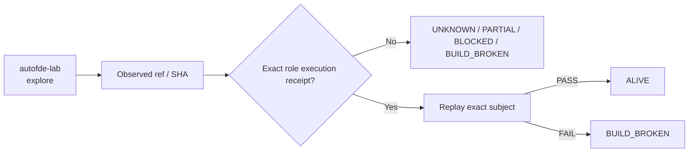

# autofde-lab — Ecosystem Status Report

> **Generated projection.** This file's facts (ref, SHA, standing, receipts) are rendered from `status/snapshot.json`, the single machine-generated source of truth. Do not hand-edit facts here; regenerate from `status/snapshot.json` instead (AGENTS.md rule 6: generated files are projections, not canonical sources).

> **Observed:** `2026-08-16T02:32:03.164547+00:00`  
> **Repository:** `seanchatmangpt/autofde-lab`  
> **Constitutional role:** `explore`  
> **Current evidence standing:** `BUILD_BROKEN`

## Executive status

| Field | Observation |
|---|---|
| Required | `true` |
| Disposition | `REQUIRED` |
| Configured ref | `master` |
| Current SHA | `87d719f441ded3af123a73b95825d5f2847f9c66` |
| Prior manifest SHA | `16e1662719174c0b6b6297eae0a8ec69a6436292` |
| Prior manifest standing | `UNKNOWN` |
| Prior execution receipt | `none` |
| Default branch | `master` |
| Latest commit | `Merge PR #66: replace local uv sources with pinned GitHub revisions` |
| Latest commit date | `2026-08-15T21:25:54Z` |
| Repository pushed_at | `2026-08-15T21:25:56Z` |
| Open PRs observed | `12` |
| GitHub open issues+PRs counter | `23` |
| Dependencies | `bcinr, gymact` |

## Standing derivation

- Latest exact-head workflow concluded `failure`.
- **Subject drift:** prior `16e1662719174c0b6b6297eae0a8ec69a6436292` → current `87d719f441ded3af123a73b95825d5f2847f9c66`. Standing does not automatically transfer across this boundary.

The report applies the ecosystem law: `Architecture != Execution`. A repository existing, a branch resolving, or generic CI passing does not by itself establish the role-specific `ALIVE` consequence. Exact-subject execution and a replayable receipt are the crown evidence.

## Current execution evidence

- Workflow: **.github/workflows/agentic-fabric.yml**
- Run ID: `31909414746`
- Status: `completed`
- Conclusion: `failure`
- Head SHA: `87d719f441ded3af123a73b95825d5f2847f9c66`
- Event: `push`
- Updated: `2026-08-15T21:25:57Z`

## Open pull requests

- #65 **feat: add receipt-gated PSRO meta-selection crown** — `agent/v26.9.1-psro-meta-selection` → `agent/planner-league-ggen`; draft=`true`; updated `2026-08-15T13:07:35Z`.
- #64 **feat(interchange): export AutoFDE planning semantics to mmdio** — `agent/mmdio-planning-export` → `master`; draft=`true`; updated `2026-08-14T06:21:18Z`.
- #63 **Domain-evidence pack: 22/22 real OCEL coverage + planner-of-planners** — `agent/l4-maturity-tickets-20260813` → `master`; draft=`true`; updated `2026-08-13T18:57:10Z`.
- #61 **feat: add Awesome AI Gyms DFCM planner frontier** — `agent/awesome-ai-gyms-frontier` → `master`; draft=`true`; updated `2026-08-13T07:14:56Z`.
- #60 **feat: add Fortune 5 enterprise planner league crown** — `agent/fortune5-planner-league-20260812` → `master`; draft=`true`; updated `2026-08-13T05:29:36Z`.
- #59 **feat: manufacture planner league and Fortune-5 architecture court with ggen** — `agent/planner-league-ggen` → `master`; draft=`true`; updated `2026-08-13T07:46:44Z`.
- #57 **feat: Sony three-round executable acceptance crown** — `agent/sony-three-round-crown-20260812` → `master`; draft=`true`; updated `2026-08-12T22:49:20Z`.
- #56 **test: eliminate vacuous DomainPack digest assertion** — `agent/vacuity-hardening-20260812` → `master`; draft=`true`; updated `2026-08-12T19:15:37Z`.
- #49 **feat(sregym): signature-driven POWL SOTA trial rail** — `agent/sregym-signature-sota` → `agent/powl-v2-concurrent-runner`; draft=`true`; updated `2026-08-11T03:50:29Z`.
- #48 **feat(powl): add fully concurrent POWL v2 runner** — `agent/powl-v2-concurrent-runner` → `master`; draft=`true`; updated `2026-08-10T17:11:58Z`.
- … plus 2 additional open PRs in the first 100 returned by GitHub.

## Next standing-changing receipt

Repair the observed exact-head failure, rerun the required execution, and capture the succeeding receipt.

## Constitutional path

## Evidence boundary

This file is an observation report for `seanchatmangpt/autofde-lab@master`. It is not an actuation receipt and cannot itself promote the component. The strongest standing shown above is derived only from exact repository/ref identity, the previous admitted fleet manifest when its subject still matches, and current GitHub execution metadata.

