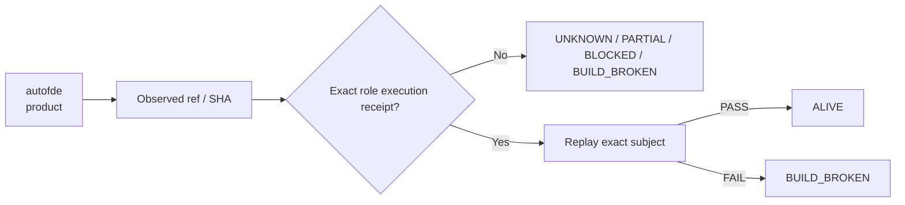

# autofde — Ecosystem Status Report

> **Generated projection.** This file's facts (ref, SHA, standing, receipts) are rendered from `status/snapshot.json`, the single machine-generated source of truth. Do not hand-edit facts here; regenerate from `status/snapshot.json` instead (AGENTS.md rule 6: generated files are projections, not canonical sources).

> **Observed:** `2026-08-16T02:32:03.164547+00:00`  
> **Repository:** `seanchatmangpt/autofde`  
> **Constitutional role:** `product`  
> **Current evidence standing:** `ALIVE`

## Executive status

| Field | Observation |
|---|---|
| Required | `true` |
| Disposition | `CROWN` |
| Configured ref | `main` |
| Current SHA | `c3f8abc2e83388b5bdb6cc1bbb8cd19a987c19c7` |
| Prior manifest SHA | `c3f8abc2e83388b5bdb6cc1bbb8cd19a987c19c7` |
| Prior manifest standing | `ALIVE` |
| Prior execution receipt | `github-actions:31775830421` |
| Default branch | `main` |
| Latest commit | `feat(release): add fail-closed v26.9.1 release crown` |
| Latest commit date | `2026-08-14T06:18:23Z` |
| Repository pushed_at | `2026-08-14T13:59:11Z` |
| Open PRs observed | `9` |
| GitHub open issues+PRs counter | `9` |
| Dependencies | `ggen, gymact, mfact, open-ontologies, star-toml` |

## Standing derivation

- Current ref still equals the prior executed SHA with an admitted execution receipt.

The report applies the ecosystem law: `Architecture != Execution`. A repository existing, a branch resolving, or generic CI passing does not by itself establish the role-specific `ALIVE` consequence. Exact-subject execution and a replayable receipt are the crown evidence.

## Current execution evidence

- Workflow: **AutoFDE ontology crown**
- Run ID: `31775830421`
- Status: `completed`
- Conclusion: `success`
- Head SHA: `c3f8abc2e83388b5bdb6cc1bbb8cd19a987c19c7`
- Event: `push`
- Updated: `2026-08-14T06:19:03Z`

## Open pull requests

- #24 **fix(release): pin current GymAct world-execution subject** — `agent/v26.9.1-pin-gymact-44` → `main`; draft=`true`; updated `2026-08-14T14:00:19Z`.
- #22 **harden: eliminate vacuous standing and incomplete Azure enumeration** — `agent/stub-vacuity-hardening` → `agent/azure-sentinel-brce-adapter`; draft=`true`; updated `2026-08-13T07:49:53Z`.
- #21 **feat(azure): close Sentinel incidents through BRCE with independent verification** — `agent/azure-sentinel-brce-adapter` → `agent/merge-crown-tip-20260812`; draft=`true`; updated `2026-08-12T16:08:33Z`.
- #20 **merge: consolidate current AutoFDE crown tip** — `agent/merge-crown-tip-20260812` → `main`; draft=`true`; updated `2026-08-12T06:33:46Z`.
- #19 **harden closed vertical composition from O* through BRCE replay** — `agent/closed-vertical-composition-hardening` → `agent/manufacture-bundle-promotion`; draft=`true`; updated `2026-08-12T03:47:45Z`.
- #18 **feat(manufacture): promote admitted O* into digest-pinned capability bundles** — `agent/manufacture-bundle-promotion` → `agent/azure-epistemic-observation-ledger`; draft=`true`; updated `2026-08-12T02:59:35Z`.
- #17 **feat(azure): admit sensed cloud state into durable O* graph** — `agent/azure-epistemic-observation-ledger` → `main`; draft=`true`; updated `2026-08-11T16:15:08Z`.
- #16 **feat(runtime): admit promoted hooks into BRCE fast path** — `agent/promoted-hook-brce-fast-path` → `main`; draft=`true`; updated `2026-08-10T16:09:30Z`.
- #15 **feat(runtime): recover compiled GymAct profile admission** — `agent/compiled-gymact-runtime` → `main`; draft=`true`; updated `2026-08-09T20:06:20Z`.

## Next standing-changing receipt

Replay the exact admitted receipt periodically; if the ref advances, obtain a new exact-head receipt.

## Constitutional path

## Evidence boundary

This file is an observation report for `seanchatmangpt/autofde@main`. It is not an actuation receipt and cannot itself promote the component. The strongest standing shown above is derived only from exact repository/ref identity, the previous admitted fleet manifest when its subject still matches, and current GitHub execution metadata.

