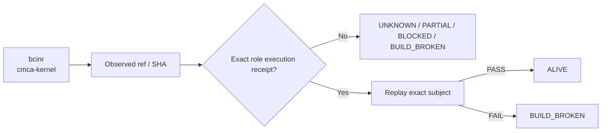

# bcinr — Ecosystem Status Report

> **Observed:** `2026-08-16T02:32:03.164547+00:00`  
> **Repository:** `seanchatmangpt/bcinr`  
> **Constitutional role:** `cmca-kernel`  
> **Current evidence standing:** `BUILD_BROKEN`

## Executive status

| Field | Observation |
|---|---|
| Required | `true` |
| Disposition | `REQUIRED` |
| Configured ref | `main` |
| Current SHA | `d6fefefdb95df5dbbb520afe7b5a4df53aa6e27f` |
| Prior manifest SHA | `d6fefefdb95df5dbbb520afe7b5a4df53aa6e27f` |
| Prior manifest standing | `UNKNOWN` |
| Prior execution receipt | `none` |
| Default branch | `main` |
| Latest commit | `Merge branch 'feat/powl-soundness-cli': CMCA residual-risk close-out + live DSPy third-party validation` |
| Latest commit date | `2026-08-13T23:10:54Z` |
| Repository pushed_at | `2026-08-15T04:08:15Z` |
| Open PRs observed | `2` |
| GitHub open issues+PRs counter | `2` |
| Dependencies | `none` |

## Standing derivation

- Latest exact-head workflow concluded `failure`.

The report applies the ecosystem law: `Architecture != Execution`. A repository existing, a branch resolving, or generic CI passing does not by itself establish the role-specific `ALIVE` consequence. Exact-subject execution and a replayable receipt are the crown evidence.

## Current execution evidence

- Workflow: **Exhaustive Validation**
- Run ID: `31875930478`
- Status: `completed`
- Conclusion: `failure`
- Head SHA: `d6fefefdb95df5dbbb520afe7b5a4df53aa6e27f`
- Event: `schedule`
- Updated: `2026-08-15T09:06:36Z`

## Open pull requests

- #29 **test(cmca): crown the v26.9.1 MFW allocation seam** — `agent/v26.9.1-mfw-cmca-contract-crown` → `main`; draft=`true`; updated `2026-08-15T08:04:09Z`.
- #27 **docs: document Forward Deployment portfolio context** — `brand/forward-deployment-os-2026-08` → `main`; draft=`true`; updated `2026-08-06T05:50:24Z`.

## Next standing-changing receipt

Repair the observed exact-head failure, rerun the required execution, and capture the succeeding receipt.

## Constitutional path

## Evidence boundary

This file is an observation report for `seanchatmangpt/bcinr@main`. It is not an actuation receipt and cannot itself promote the component. The strongest standing shown above is derived only from exact repository/ref identity, the previous admitted fleet manifest when its subject still matches, and current GitHub execution metadata.

