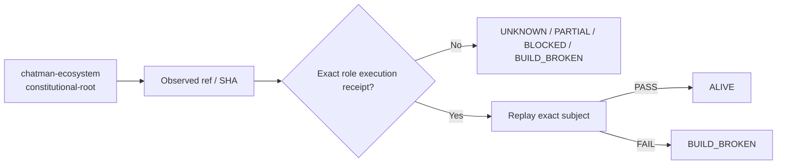

# chatman-ecosystem — Ecosystem Status Report

> **Generated projection.** This file's facts (ref, SHA, standing, receipts) are rendered from `status/snapshot.json`, the single machine-generated source of truth. Do not hand-edit facts here; regenerate from `status/snapshot.json` instead (AGENTS.md rule 6: generated files are projections, not canonical sources).

> **Observed:** `2026-08-16T02:32:03.164547+00:00`  
> **Repository:** `seanchatmangpt/chatman-ecosystem`  
> **Constitutional role:** `constitutional-root`  
> **Current evidence standing:** `PARTIAL_ALIVE`

## Executive status

| Field | Observation |
|---|---|
| Required | `true` |
| Disposition | `REQUIRED` |
| Configured ref | `agent/v26.9.1-constitutional-thesis` |
| Current SHA | `4bab49c7bbc41b980c96fbf288991cf4bfccc923` |
| Prior manifest SHA | `4bab49c7bbc41b980c96fbf288991cf4bfccc923` |
| Prior manifest standing | `PARTIAL_ALIVE` |
| Prior execution receipt | `none` |
| Default branch | `main` |
| Latest commit | `repair ecosystem status generator` |
| Latest commit date | `2026-08-16T02:31:56Z` |
| Repository pushed_at | `2026-08-16T02:31:56Z` |
| Open PRs observed | `10` |
| GitHub open issues+PRs counter | `11` |
| Dependencies | `none` |

## Standing derivation

- Exact-head execution is currently pending or in progress.

The report applies the ecosystem law: `Architecture != Execution`. A repository existing, a branch resolving, or generic CI passing does not by itself establish the role-specific `ALIVE` consequence. Exact-subject execution and a replayable receipt are the crown evidence.

## Current execution evidence

- Workflow: **Repair and generate ecosystem repo status reports**
- Run ID: `31922109004`
- Status: `in_progress`
- Conclusion: `None`
- Head SHA: `4bab49c7bbc41b980c96fbf288991cf4bfccc923`
- Event: `push`
- Updated: `2026-08-16T02:32:01Z`

## Open pull requests

- #11 **docs: freeze v26.9.1 constitutional thesis corpus** — `agent/v26.9.1-constitutional-thesis-corpus` → `main`; draft=`true`; updated `2026-08-16T01:24:42Z`.
- #10 **bootstrap v26.9.1 constitutional thesis** — `agent/v26.9.1-constitutional-thesis` → `main`; draft=`true`; updated `2026-08-16T02:31:58Z`.
- #9 **test(release): crown QLever structural similarity at 2M triples** — `agent/v26.9.1-qlever-structural-crown` → `agent/v26.9.1-release-control-plane`; draft=`true`; updated `2026-08-15T13:11:19Z`.
- #8 **feat(release): establish v26.9.1 ecosystem control plane** — `agent/v26.9.1-release-control-plane` → `main`; draft=`true`; updated `2026-08-15T20:17:56Z`.
- #7 **docs: audit stubs and incomplete WIP** — `audit/stubs-wip-2026-08-08` → `main`; draft=`true`; updated `2026-08-08T22:02:01Z`.
- #5 **docs: define and operationalize the Forward Deployment OS rebrand** — `brand/forward-deployment-os-2026-08` → `main`; draft=`true`; updated `2026-08-06T05:26:28Z`.
- #4 **ci(validation): crown MFW PyPI planning at 18294174** — `validation/mfw-pypi-crown-18294174` → `main`; draft=`true`; updated `2026-08-05T21:12:03Z`.
- #3 **ci(validation): execute exact MFW PyPI planning capsule** — `validation/mfw-pypi-planning-5e9b3c41` → `main`; draft=`true`; updated `2026-08-05T20:50:31Z`.
- #2 **Implement GALL checkpoints for phases 0-3** — `agent/gall-phases-0-3` → `main`; draft=`true`; updated `2026-08-05T20:16:46Z`.
- #1 **Complete Chatman Ecosystem Crown control plane** — `agent/crown-completion` → `main`; draft=`true`; updated `2026-08-05T20:27:41Z`.

## Next standing-changing receipt

Execute the narrowest exact-head semantic boundary required for this role and capture a replayable receipt.

## Constitutional path

## Evidence boundary

This file is an observation report for `seanchatmangpt/chatman-ecosystem@agent/v26.9.1-constitutional-thesis`. It is not an actuation receipt and cannot itself promote the component. The strongest standing shown above is derived only from exact repository/ref identity, the previous admitted fleet manifest when its subject still matches, and current GitHub execution metadata.

