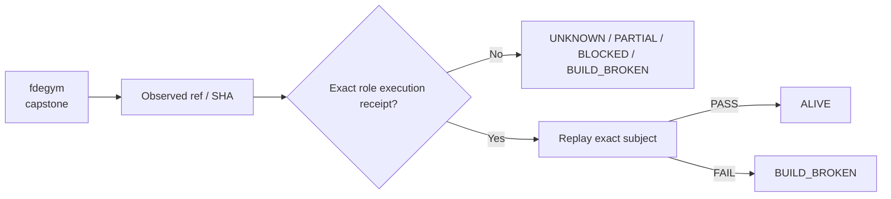

# fdegym — Ecosystem Status Report

> **Observed:** `2026-08-16T02:32:03.164547+00:00`  
> **Repository:** `seanchatmangpt/fdegym`  
> **Constitutional role:** `capstone`  
> **Current evidence standing:** `PARTIAL_ALIVE`

## Executive status

| Field | Observation |
|---|---|
| Required | `true` |
| Disposition | `CROWN` |
| Configured ref | `main` |
| Current SHA | `2d7c5acb3cbb8df1608cf9b81be53a74e39a1946` |
| Prior manifest SHA | `2d7c5acb3cbb8df1608cf9b81be53a74e39a1946` |
| Prior manifest standing | `UNKNOWN` |
| Prior execution receipt | `none` |
| Default branch | `main` |
| Latest commit | `Merge pull request #3 from seanchatmangpt/agent/v26.9.1-capstone-maturity` |
| Latest commit date | `2026-08-14T19:07:48Z` |
| Repository pushed_at | `2026-08-14T19:07:48Z` |
| Open PRs observed | `0` |
| GitHub open issues+PRs counter | `0` |
| Dependencies | `affidavit, autofde, autofde-lab, gymact, mfact, mfw, wasm4pm` |

## Standing derivation

- Exact-head CI success is observed, but generic CI is not automatically a semantic execution receipt.

The report applies the ecosystem law: `Architecture != Execution`. A repository existing, a branch resolving, or generic CI passing does not by itself establish the role-specific `ALIVE` consequence. Exact-subject execution and a replayable receipt are the crown evidence.

## Current execution evidence

- Workflow: **ci**
- Run ID: `31831866458`
- Status: `completed`
- Conclusion: `success`
- Head SHA: `2d7c5acb3cbb8df1608cf9b81be53a74e39a1946`
- Event: `push`
- Updated: `2026-08-14T19:08:11Z`

## Open pull requests

- None observed.

## Next standing-changing receipt

Execute the narrowest exact-head semantic boundary required for this role and capture a replayable receipt.

## Constitutional path

## Evidence boundary

This file is an observation report for `seanchatmangpt/fdegym@main`. It is not an actuation receipt and cannot itself promote the component. The strongest standing shown above is derived only from exact repository/ref identity, the previous admitted fleet manifest when its subject still matches, and current GitHub execution metadata.

