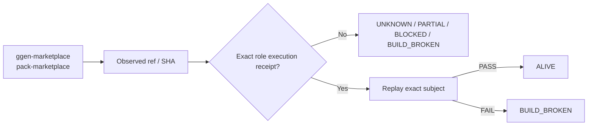

# ggen-marketplace — Ecosystem Status Report

> **Generated projection.** This file's facts (ref, SHA, standing, receipts) are rendered from `status/snapshot.json`, the single machine-generated source of truth. Do not hand-edit facts here; regenerate from `status/snapshot.json` instead (AGENTS.md rule 6: generated files are projections, not canonical sources).

> **Observed:** `2026-08-16T02:32:03.164547+00:00`  
> **Repository:** `seanchatmangpt/ggen-marketplace`  
> **Constitutional role:** `pack-marketplace`  
> **Current evidence standing:** `PARTIAL_ALIVE`

## Executive status

| Field | Observation |
|---|---|
| Required | `true` |
| Disposition | `REQUIRED` |
| Configured ref | `main` |
| Current SHA | `05294230a90fbabea5d4b1bd64fc7a1b2a835e02` |
| Prior manifest SHA | `17b716d133cf67a45d62e514cc38939283337222` |
| Prior manifest standing | `ALIVE` |
| Prior execution receipt | `github-actions:31842339853` |
| Default branch | `main` |
| Latest commit | `Merge pull request #37 from seanchatmangpt/agent/v26.9.1-ecosystem-release-gate-pack` |
| Latest commit date | `2026-08-15T23:45:12Z` |
| Repository pushed_at | `2026-08-15T23:49:15Z` |
| Open PRs observed | `7` |
| GitHub open issues+PRs counter | `7` |
| Dependencies | `ggen` |

## Standing derivation

- Exact-head CI success is observed, but generic CI is not automatically a semantic execution receipt.
- **Subject drift:** prior `17b716d133cf67a45d62e514cc38939283337222` → current `05294230a90fbabea5d4b1bd64fc7a1b2a835e02`. Standing does not automatically transfer across this boundary.

The report applies the ecosystem law: `Architecture != Execution`. A repository existing, a branch resolving, or generic CI passing does not by itself establish the role-specific `ALIVE` consequence. Exact-subject execution and a replayable receipt are the crown evidence.

## Current execution evidence

- Workflow: **Publish**
- Run ID: `31915540956`
- Status: `completed`
- Conclusion: `success`
- Head SHA: `05294230a90fbabea5d4b1bd64fc7a1b2a835e02`
- Event: `push`
- Updated: `2026-08-15T23:47:36Z`

## Open pull requests

- #38 **feat: add Chatman TOGAF lifecycle closure pack** — `agent/chatman-togaf-closure-pack` → `main`; draft=`true`; updated `2026-08-15T23:51:10Z`.
- #36 **Add CASTLE base and DfCM Fortune-5 board packs** — `agent/castle-pack` → `main`; draft=`true`; updated `2026-08-15T21:58:38Z`.
- #35 **feat(ggen-legacy): add Fortune 5 ingestion compiler pack** — `agent/ggen-legacy-fortune5-ingestion-pack-v2-20260814` → `main`; draft=`true`; updated `2026-08-15T10:02:24Z`.
- #34 **feat: add protocol-complete Fortune-5 gdmcp pack** — `feat/gdmcp-full-mcp` → `main`; draft=`true`; updated `2026-08-15T12:02:52Z`.
- #33 **Add DfCM pack with Fortune 5 readiness calculus** — `agent/dfcm-pack` → `main`; draft=`true`; updated `2026-08-15T07:05:35Z`.
- #32 **expand $20/hr FDE RevOps for Fortune 5 readiness** — `agent/fde20-revops-pack` → `main`; draft=`true`; updated `2026-08-15T13:59:46Z`.
- #31 **feat(dfcm): full DfCM + Fortune 5 readiness pack** — `feat/dfcm-full-deployment-pack` → `main`; draft=`true`; updated `2026-08-15T06:59:30Z`.

## Next standing-changing receipt

Execute the narrowest exact-head semantic boundary required for this role and capture a replayable receipt.

## Constitutional path

## Evidence boundary

This file is an observation report for `seanchatmangpt/ggen-marketplace@main`. It is not an actuation receipt and cannot itself promote the component. The strongest standing shown above is derived only from exact repository/ref identity, the previous admitted fleet manifest when its subject still matches, and current GitHub execution metadata.

