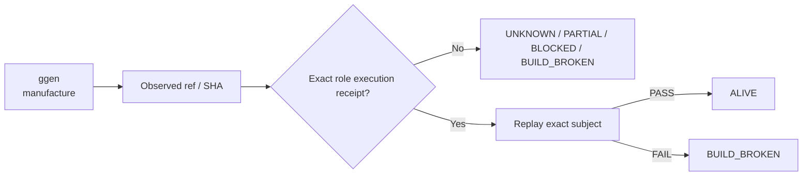

# ggen — Ecosystem Status Report

> **Generated projection.** This file's facts (ref, SHA, standing, receipts) are rendered from `status/snapshot.json`, the single machine-generated source of truth. Do not hand-edit facts here; regenerate from `status/snapshot.json` instead (AGENTS.md rule 6: generated files are projections, not canonical sources).

> **Observed:** `2026-08-16T02:32:03.164547+00:00`  
> **Repository:** `seanchatmangpt/ggen`  
> **Constitutional role:** `manufacture`  
> **Current evidence standing:** `PARTIAL_ALIVE`

## Executive status

| Field | Observation |
|---|---|
| Required | `true` |
| Disposition | `REQUIRED` |
| Configured ref | `main` |
| Current SHA | `162e466d8f07d0a75a468b4441b4bc8b1aad369b` |
| Prior manifest SHA | `162e466d8f07d0a75a468b4441b4bc8b1aad369b` |
| Prior manifest standing | `UNKNOWN` |
| Prior execution receipt | `none` |
| Default branch | `main` |
| Latest commit | `chore(release): bump version to 26.8.15 (#633)` |
| Latest commit date | `2026-08-13T01:15:54Z` |
| Repository pushed_at | `2026-08-16T01:15:52Z` |
| Open PRs observed | `11` |
| GitHub open issues+PRs counter | `11` |
| Dependencies | `none` |

## Standing derivation

- Exact-head CI success is observed, but generic CI is not automatically a semantic execution receipt.

The report applies the ecosystem law: `Architecture != Execution`. A repository existing, a branch resolving, or generic CI passing does not by itself establish the role-specific `ALIVE` consequence. Exact-subject execution and a replayable receipt are the crown evidence.

## Current execution evidence

- Workflow: **Release**
- Run ID: `31657153423`
- Status: `completed`
- Conclusion: `success`
- Head SHA: `162e466d8f07d0a75a468b4441b4bc8b1aad369b`
- Event: `workflow_dispatch`
- Updated: `2026-08-13T01:55:12Z`

## Open pull requests

- #637 **fix(examples): close the live example corpus** — `fix/finish-live-examples` → `main`; draft=`true`; updated `2026-08-16T01:15:53Z`.
- #635 **feat(bcinr): reconstitute claim/evidence contract authority** — `agent/bcinr-evidence-contract-reconstitution` → `main`; draft=`true`; updated `2026-08-15T19:02:25Z`.
- #634 **feat(architecture): add canonical enterprise architecture calculus** — `fde/enterprise-architecture` → `main`; draft=`true`; updated `2026-08-13T03:00:41Z`.
- #630 **feat(graph): admit heterogeneous RDF ontology sources** — `fde/rdf-source-admission` → `main`; draft=`true`; updated `2026-08-13T00:23:35Z`.
- #628 **refactor(foundry): move tools/architecture-foundry to ggen-legacy** — `agent/move-architecture-foundry-to-ggen-legacy` → `main`; draft=`false`; updated `2026-08-12T23:41:30Z`.
- #625 **feat(foundry): connect catalog envelopes to manufacture boundary** — `agent/enterprise-connection-manufacture-20260812` → `main`; draft=`true`; updated `2026-08-12T23:22:37Z`.
- #617 **merge: consolidate open ggen hardening tips** — `agent/merge-crown-tip-20260812` → `main`; draft=`true`; updated `2026-08-12T06:35:11Z`.
- #616 **harden pack qualification and SPARQL gate complexity** — `agent/qualification-hardening` → `main`; draft=`true`; updated `2026-08-12T03:40:27Z`.
- #615 **fix(autofde): make execution-profile JSON admission executable** — `agent/autofde-execution-profile-hardening` → `main`; draft=`true`; updated `2026-08-12T03:41:19Z`.
- #614 **fix(autofde): harden manufacturer receipt provenance** — `agent/autofde-manufacturer-hardening` → `main`; draft=`true`; updated `2026-08-12T03:49:03Z`.
- … plus 1 additional open PRs in the first 100 returned by GitHub.

## Next standing-changing receipt

Execute the narrowest exact-head semantic boundary required for this role and capture a replayable receipt.

## Constitutional path

## Evidence boundary

This file is an observation report for `seanchatmangpt/ggen@main`. It is not an actuation receipt and cannot itself promote the component. The strongest standing shown above is derived only from exact repository/ref identity, the previous admitted fleet manifest when its subject still matches, and current GitHub execution metadata.

