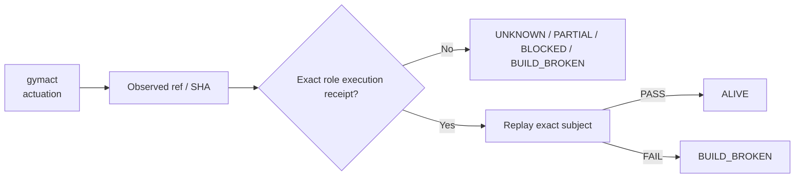

# gymact — Ecosystem Status Report

> **Observed:** `2026-08-16T02:32:03.164547+00:00`  
> **Repository:** `seanchatmangpt/gymact`  
> **Constitutional role:** `actuation`  
> **Current evidence standing:** `BUILD_BROKEN`

## Executive status

| Field | Observation |
|---|---|
| Required | `true` |
| Disposition | `REQUIRED` |
| Configured ref | `feat/llmless-ggen-agents-fortune5-mna` |
| Current SHA | `cf9a36fcc5b0738269809b83e3ffcad7dae0a5c4` |
| Prior manifest SHA | `cf9a36fcc5b0738269809b83e3ffcad7dae0a5c4` |
| Prior manifest standing | `BLOCKED` |
| Prior execution receipt | `none` |
| Default branch | `main` |
| Latest commit | `fix: compile PROV-qualified agent associations lawfully` |
| Latest commit date | `2026-08-14T07:23:13Z` |
| Repository pushed_at | `2026-08-15T23:26:00Z` |
| Open PRs observed | `0` |
| GitHub open issues+PRs counter | `0` |
| Dependencies | `ggen, open-ontologies` |

## Standing derivation

- Latest exact-head workflow concluded `failure`.
- Prior manifest blocker: `GITHUB_ACTIONS_BILLING_OR_SPENDING_LIMIT`.

The report applies the ecosystem law: `Architecture != Execution`. A repository existing, a branch resolving, or generic CI passing does not by itself establish the role-specific `ALIVE` consequence. Exact-subject execution and a replayable receipt are the crown evidence.

## Current execution evidence

- Workflow: **CI**
- Run ID: `31779733283`
- Status: `completed`
- Conclusion: `failure`
- Head SHA: `cf9a36fcc5b0738269809b83e3ffcad7dae0a5c4`
- Event: `pull_request`
- Updated: `2026-08-14T07:23:23Z`

## Open pull requests

- None observed.

## Next standing-changing receipt

Repair the observed exact-head failure, rerun the required execution, and capture the succeeding receipt.

## Constitutional path

## Evidence boundary

This file is an observation report for `seanchatmangpt/gymact@feat/llmless-ggen-agents-fortune5-mna`. It is not an actuation receipt and cannot itself promote the component. The strongest standing shown above is derived only from exact repository/ref identity, the previous admitted fleet manifest when its subject still matches, and current GitHub execution metadata.

