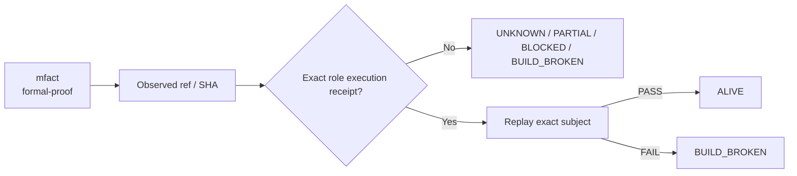

# mfact — Ecosystem Status Report

> **Observed:** `2026-08-16T02:32:03.164547+00:00`  
> **Repository:** `seanchatmangpt/mfact`  
> **Constitutional role:** `formal-proof`  
> **Current evidence standing:** `PARTIAL_ALIVE`

## Executive status

| Field | Observation |
|---|---|
| Required | `true` |
| Disposition | `REQUIRED` |
| Configured ref | `main` |
| Current SHA | `308384002a15b9946acbcd6f560c5819723d79dc` |
| Prior manifest SHA | `308384002a15b9946acbcd6f560c5819723d79dc` |
| Prior manifest standing | `UNKNOWN` |
| Prior execution receipt | `none` |
| Default branch | `main` |
| Latest commit | `Merge PR #2: manufacture wasm4pm D1 Lean correspondence` |
| Latest commit date | `2026-08-05T05:28:45Z` |
| Repository pushed_at | `2026-08-06T05:03:36Z` |
| Open PRs observed | `1` |
| GitHub open issues+PRs counter | `1` |
| Dependencies | `ggen` |

## Standing derivation

- Exact-head CI success is observed, but generic CI is not automatically a semantic execution receipt.

The report applies the ecosystem law: `Architecture != Execution`. A repository existing, a branch resolving, or generic CI passing does not by itself establish the role-specific `ALIVE` consequence. Exact-subject execution and a replayable receipt are the crown evidence.

## Current execution evidence

- Workflow: **CI**
- Run ID: `30978227109`
- Status: `completed`
- Conclusion: `success`
- Head SHA: `308384002a15b9946acbcd6f560c5819723d79dc`
- Event: `push`
- Updated: `2026-08-05T07:02:53Z`

## Open pull requests

- #4 **docs: position mfact in the Forward Deployment OS** — `brand/forward-deployment-os-2026-08` → `main`; draft=`true`; updated `2026-08-06T05:03:44Z`.

## Next standing-changing receipt

Execute the narrowest exact-head semantic boundary required for this role and capture a replayable receipt.

## Constitutional path

## Evidence boundary

This file is an observation report for `seanchatmangpt/mfact@main`. It is not an actuation receipt and cannot itself promote the component. The strongest standing shown above is derived only from exact repository/ref identity, the previous admitted fleet manifest when its subject still matches, and current GitHub execution metadata.

