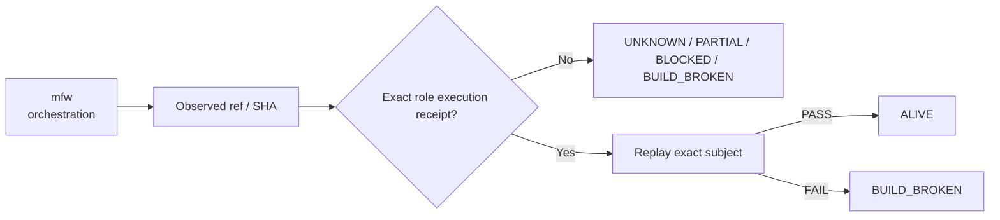

# mfw — Ecosystem Status Report

> **Observed:** `2026-08-16T02:32:03.164547+00:00`  
> **Repository:** `seanchatmangpt/mfw`  
> **Constitutional role:** `orchestration`  
> **Current evidence standing:** `BLOCKED`

## Executive status

| Field | Observation |
|---|---|
| Required | `true` |
| Disposition | `REQUIRED` |
| Configured ref | `agent/finish-cmca-mfw` |
| Current SHA | `UNRESOLVED` |
| Prior manifest SHA | `2ecde02f9d7eaea50cfb4ea7876340c6463ac3a1` |
| Prior manifest standing | `BLOCKED` |
| Prior execution receipt | `none` |
| Default branch | `unknown` |
| Latest commit | `unknown` |
| Latest commit date | `unknown` |
| Repository pushed_at | `unknown` |
| Open PRs observed | `0` |
| GitHub open issues+PRs counter | `unknown` |
| Dependencies | `bcinr` |

## Standing derivation

- Configured ref `agent/finish-cmca-mfw` could not be resolved.
- Prior manifest blocker: `GITHUB_ACTIONS_BILLING_OR_SPENDING_LIMIT`.

The report applies the ecosystem law: `Architecture != Execution`. A repository existing, a branch resolving, or generic CI passing does not by itself establish the role-specific `ALIVE` consequence. Exact-subject execution and a replayable receipt are the crown evidence.

## Current execution evidence

- No workflow run among the latest 20 runs on the configured ref matched the current exact SHA.

## Open pull requests

- None observed.

## Next standing-changing receipt

Remove or receipt the external prerequisite, then rerun the exact subject.

## Constitutional path

## Evidence boundary

This file is an observation report for `seanchatmangpt/mfw@agent/finish-cmca-mfw`. It is not an actuation receipt and cannot itself promote the component. The strongest standing shown above is derived only from exact repository/ref identity, the previous admitted fleet manifest when its subject still matches, and current GitHub execution metadata.

