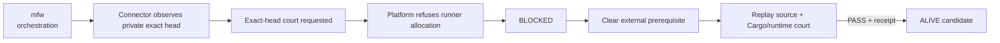

# mfw — Ecosystem Status Report

> **Observed:** `2026-08-16T02:35:21.811125+00:00`  
> **Repository:** `seanchatmangpt/mfw`  
> **Visibility:** `private`  
> **Constitutional role:** `orchestration`  
> **Current evidence standing:** `BLOCKED`

## Executive status

| Field | Observation |
|---|---|
| Required | `true` |
| Disposition | `REQUIRED` |
| Configured ref | `agent/finish-cmca-mfw` |
| Current SHA | `a808821c6636535bc80f59f660b5b35906948c8e` |
| Prior manifest SHA | `2ecde02f9d7eaea50cfb4ea7876340c6463ac3a1` |
| Prior manifest standing | `BLOCKED` |
| Current blocker | `GITHUB_ACTIONS_BILLING_OR_SPENDING_LIMIT` |
| Default branch | `main` |
| Latest branch commit | `ci(cmca): execute source court before Cargo gate` |
| Latest branch commit date | `2026-08-15T15:05:03Z` |
| Repository pushed_at | `2026-08-15T15:05:03Z` |
| Open PRs observed | `1` |
| GitHub open issues+PRs counter | `11` |
| Dependencies | `bcinr` |
| Observation authority | `authenticated-github-connector` |

## Standing derivation

- The configured private ref resolves through the connected GitHub app at exact head `a808821c6636535bc80f59f660b5b35906948c8e`.
- The prior manifest subject has advanced, so its older SHA cannot be inherited as current execution standing.
- Exact-head workflow run `31891716973` completed with GitHub conclusion `failure`, but PR #66 records zero runner steps and the platform refusal that recent account payments failed or the spending limit must be increased.
- This is therefore `BLOCKED:GITHUB_ACTIONS_BILLING_OR_SPENDING_LIMIT`, not a source/build falsifier.
- PR #66 reports local verifier-capsule mechanics and replay as `ALIVE`, exact remote source/runtime execution as `BLOCKED`, and the orchestration edge overall as `PARTIAL_ALIVE`; fleet consequential standing remains `BLOCKED` until the remote court executes.
- The branch Actions token could not observe this private sibling repository. The authenticated GitHub connector supplied the current private-subject observation; lack of observation authority must not be mistaken for ref nonexistence.

The report applies `Architecture != Execution`: local source verification cannot substitute for the exact remote Cargo/runtime court, and a GitHub failure label caused before runner allocation cannot be retyped as `BUILD_BROKEN`.

## Current execution evidence

- Workflow: **MFW CMCA bridge exact-head court**
- Run ID: `31891716973`
- Status: `completed`
- GitHub conclusion: `failure`
- Constitutional interpretation: `BLOCKED` because the required runner never started
- Head SHA: `a808821c6636535bc80f59f660b5b35906948c8e`
- Event: `pull_request`
- Updated: `2026-08-15T15:05:11Z`
- Platform refusal: `The job was not started because recent account payments have failed or your spending limit needs to be increased.`

## Open pull requests

- #66 **feat(cmca): add bounded BCINR allocation bridge** — `agent/finish-cmca-mfw` → `main`; draft=`true`; exact head `a808821c6636535bc80f59f660b5b35906948c8e`.

## Next standing-changing receipt

Clear or receipt the GitHub Actions billing/spending-limit block, then rerun the exact head. Required evidence is execution of the source court followed by the unchanged Cargo/runtime gates and a replayable exact-head receipt.

## Constitutional path

## Evidence boundary

This is an observation report, not an actuation receipt. The private subject is observable through the authenticated GitHub connector; promotion requires the blocked exact-head court to execute and receipt its consequence.
