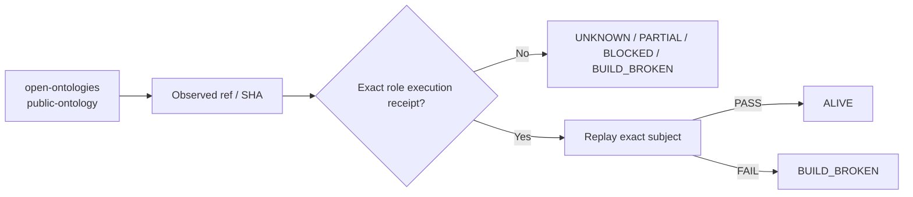

# open-ontologies — Ecosystem Status Report

> **Generated projection.** This file's facts (ref, SHA, standing, receipts) are rendered from `status/snapshot.json`, the single machine-generated source of truth. Do not hand-edit facts here; regenerate from `status/snapshot.json` instead (AGENTS.md rule 6: generated files are projections, not canonical sources).

> **Observed:** `2026-08-16T02:32:03.164547+00:00`  
> **Repository:** `seanchatmangpt/open-ontologies`  
> **Constitutional role:** `public-ontology`  
> **Current evidence standing:** `BUILD_BROKEN`

## Executive status

| Field | Observation |
|---|---|
| Required | `true` |
| Disposition | `REQUIRED` |
| Configured ref | `main` |
| Current SHA | `16d01cfcbc2a8efe2f074776fa4a4e5fe6701b99` |
| Prior manifest SHA | `16d01cfcbc2a8efe2f074776fa4a4e5fe6701b99` |
| Prior manifest standing | `UNKNOWN` |
| Prior execution receipt | `none` |
| Default branch | `main` |
| Latest commit | `ci(zoela): retire atomic authority executor from trusted base` |
| Latest commit date | `2026-07-31T19:02:14Z` |
| Repository pushed_at | `2026-08-14T06:50:30Z` |
| Open PRs observed | `2` |
| GitHub open issues+PRs counter | `2` |
| Dependencies | `none` |

## Standing derivation

- Latest exact-head workflow concluded `failure`.

The report applies the ecosystem law: `Architecture != Execution`. A repository existing, a branch resolving, or generic CI passing does not by itself establish the role-specific `ALIVE` consequence. Exact-subject execution and a replayable receipt are the crown evidence.

## Current execution evidence

- Workflow: **cascade**
- Run ID: `31885943116`
- Status: `completed`
- Conclusion: `failure`
- Head SHA: `16d01cfcbc2a8efe2f074776fa4a4e5fe6701b99`
- Event: `schedule`
- Updated: `2026-08-15T12:58:08Z`

## Open pull requests

- #37 **feat(dflss): add DMEDI arXiv coverage ontology** — `agent/dflss-dmedi-arxiv-20260814` → `main`; draft=`true`; updated `2026-08-14T06:50:31Z`.
- #36 **docs: position open ontologies in the Forward Deployment OS** — `brand/forward-deployment-os-2026-08` → `main`; draft=`true`; updated `2026-08-06T05:07:52Z`.

## Next standing-changing receipt

Repair the observed exact-head failure, rerun the required execution, and capture the succeeding receipt.

## Constitutional path

## Evidence boundary

This file is an observation report for `seanchatmangpt/open-ontologies@main`. It is not an actuation receipt and cannot itself promote the component. The strongest standing shown above is derived only from exact repository/ref identity, the previous admitted fleet manifest when its subject still matches, and current GitHub execution metadata.

