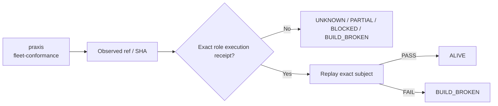

# praxis — Ecosystem Status Report

> **Observed:** `2026-08-16T02:32:03.164547+00:00`  
> **Repository:** `seanchatmangpt/praxis`  
> **Constitutional role:** `fleet-conformance`  
> **Current evidence standing:** `BUILD_BROKEN`

## Executive status

| Field | Observation |
|---|---|
| Required | `true` |
| Disposition | `REQUIRED` |
| Configured ref | `main` |
| Current SHA | `bc6b842e0b86e718b098ff3abdc47ef2ad83ee4b` |
| Prior manifest SHA | `bc6b842e0b86e718b098ff3abdc47ef2ad83ee4b` |
| Prior manifest standing | `UNKNOWN` |
| Prior execution receipt | `none` |
| Default branch | `main` |
| Latest commit | `Merge pull request #11 from seanchatmangpt/agent/chatmangpt-namespace-26.7.29` |
| Latest commit date | `2026-08-01T02:45:48Z` |
| Repository pushed_at | `2026-08-15T00:49:29Z` |
| Open PRs observed | `4` |
| GitHub open issues+PRs counter | `4` |
| Dependencies | `ggen` |

## Standing derivation

- Latest exact-head workflow concluded `failure`.

The report applies the ecosystem law: `Architecture != Execution`. A repository existing, a branch resolving, or generic CI passing does not by itself establish the role-specific `ALIVE` consequence. Exact-subject execution and a replayable receipt are the crown evidence.

## Current execution evidence

- Workflow: **.github/workflows/praxis-validate.yml**
- Run ID: `31854245672`
- Status: `completed`
- Conclusion: `failure`
- Head SHA: `bc6b842e0b86e718b098ff3abdc47ef2ad83ee4b`
- Event: `push`
- Updated: `2026-08-15T00:38:54Z`

## Open pull requests

- #14 **feat(graphlaw): compile Blue Ocean and TRIZ into RDF innovation laws** — `agent/graphlaw-blue-ocean-innovation` → `main`; draft=`true`; updated `2026-08-15T00:49:30Z`.
- #13 **feat: compose Praxis with the Chatman ecosystem** — `feat/chatman-ecosystem-contract` → `main`; draft=`true`; updated `2026-08-14T04:41:54Z`.
- #9 **ci: bump actions/download-artifact from 4 to 8** — `dependabot/github_actions/actions/download-artifact-8` → `main`; draft=`false`; updated `2026-06-23T17:53:18Z`.
- #4 **ci: bump dtolnay/rust-toolchain from 1.82 to 1.100 in the minor-and-patch group** — `dependabot/github_actions/minor-and-patch-85fc92c4ea` → `main`; draft=`false`; updated `2026-08-11T02:51:39Z`.

## Next standing-changing receipt

Repair the observed exact-head failure, rerun the required execution, and capture the succeeding receipt.

## Constitutional path

## Evidence boundary

This file is an observation report for `seanchatmangpt/praxis@main`. It is not an actuation receipt and cannot itself promote the component. The strongest standing shown above is derived only from exact repository/ref identity, the previous admitted fleet manifest when its subject still matches, and current GitHub execution metadata.

