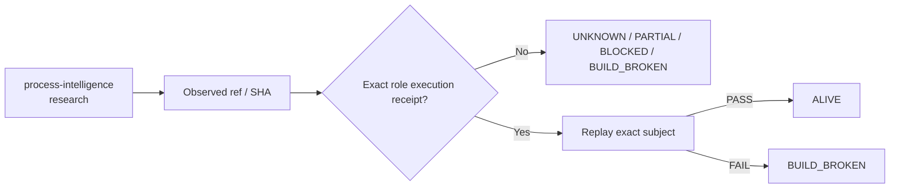

# process-intelligence — Ecosystem Status Report

> **Generated projection.** This file's facts (ref, SHA, standing, receipts) are rendered from `status/snapshot.json`, the single machine-generated source of truth. Do not hand-edit facts here; regenerate from `status/snapshot.json` instead (AGENTS.md rule 6: generated files are projections, not canonical sources).

> **Observed:** `2026-08-16T02:32:03.164547+00:00`  
> **Repository:** `seanchatmangpt/process-intelligence`  
> **Constitutional role:** `research`  
> **Current evidence standing:** `PARTIAL_ALIVE`

## Executive status

| Field | Observation |
|---|---|
| Required | `true` |
| Disposition | `REQUIRED` |
| Configured ref | `main` |
| Current SHA | `4492a9f92cd85d518b76a9cbd9c74418cf3ad44a` |
| Prior manifest SHA | `4492a9f92cd85d518b76a9cbd9c74418cf3ad44a` |
| Prior manifest standing | `UNKNOWN` |
| Prior execution receipt | `none` |
| Default branch | `main` |
| Latest commit | `Merge pull request #3 from seanchatmangpt/feat/alive-002-executable-gate` |
| Latest commit date | `2026-08-14T06:25:55Z` |
| Repository pushed_at | `2026-08-14T06:25:55Z` |
| Open PRs observed | `1` |
| GitHub open issues+PRs counter | `1` |
| Dependencies | `none` |

## Standing derivation

- Exact-head CI success is observed, but generic CI is not automatically a semantic execution receipt.

The report applies the ecosystem law: `Architecture != Execution`. A repository existing, a branch resolving, or generic CI passing does not by itself establish the role-specific `ALIVE` consequence. Exact-subject execution and a replayable receipt are the crown evidence.

## Current execution evidence

- Workflow: **PROCESS_INTELLIGENCE_DEFINITION_OF_DONE**
- Run ID: `31776262916`
- Status: `completed`
- Conclusion: `success`
- Head SHA: `4492a9f92cd85d518b76a9cbd9c74418cf3ad44a`
- Event: `push`
- Updated: `2026-08-14T06:26:10Z`

## Open pull requests

- #2 **docs: position process intelligence in the Forward Deployment OS** — `brand/forward-deployment-os-2026-08` → `main`; draft=`true`; updated `2026-08-06T05:07:26Z`.

## Next standing-changing receipt

Execute the narrowest exact-head semantic boundary required for this role and capture a replayable receipt.

## Constitutional path

## Evidence boundary

This file is an observation report for `seanchatmangpt/process-intelligence@main`. It is not an actuation receipt and cannot itself promote the component. The strongest standing shown above is derived only from exact repository/ref identity, the previous admitted fleet manifest when its subject still matches, and current GitHub execution metadata.

