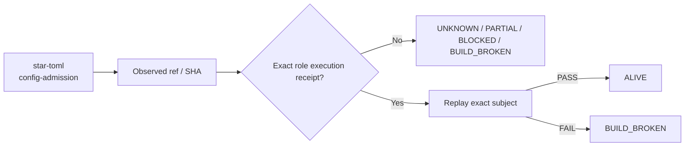

# star-toml — Ecosystem Status Report

> **Observed:** `2026-08-16T02:32:03.164547+00:00`  
> **Repository:** `seanchatmangpt/star-toml`  
> **Constitutional role:** `config-admission`  
> **Current evidence standing:** `BUILD_BROKEN`

## Executive status

| Field | Observation |
|---|---|
| Required | `true` |
| Disposition | `REQUIRED` |
| Configured ref | `main` |
| Current SHA | `8395515cf8e68bfdc9edff49fb358c4f1da7c795` |
| Prior manifest SHA | `8395515cf8e68bfdc9edff49fb358c4f1da7c795` |
| Prior manifest standing | `BUILD_BROKEN` |
| Prior execution receipt | `github-actions:30680591983` |
| Default branch | `main` |
| Latest commit | `Merge pull request #9 from seanchatmangpt/agent/chatmangpt-namespace-26.7.29` |
| Latest commit date | `2026-08-01T02:44:04Z` |
| Repository pushed_at | `2026-08-09T21:44:14Z` |
| Open PRs observed | `8` |
| GitHub open issues+PRs counter | `8` |
| Dependencies | `wasm4pm-compat` |

## Standing derivation

- Prior exact-subject BUILD_BROKEN evidence still applies and no newer exact-head success supersedes it.
- Prior manifest blocker: `REQUIRED_CI_GATES_FAILED`.

The report applies the ecosystem law: `Architecture != Execution`. A repository existing, a branch resolving, or generic CI passing does not by itself establish the role-specific `ALIVE` consequence. Exact-subject execution and a replayable receipt are the crown evidence.

## Current execution evidence

- Workflow: **github_actions in / for dtolnay/rust-toolchain - Update #1515570310**
- Run ID: `31337503224`
- Status: `completed`
- Conclusion: `success`
- Head SHA: `8395515cf8e68bfdc9edff49fb358c4f1da7c795`
- Event: `dynamic`
- Updated: `2026-08-09T21:43:06Z`

## Open pull requests

- #12 **cargo: bump the minor-and-patch group across 1 directory with 11 updates** — `dependabot/cargo/minor-and-patch-5753cf405a` → `main`; draft=`false`; updated `2026-08-09T21:44:15Z`.
- #11 **docs: position star-toml in the Forward Deployment OS** — `brand/forward-deployment-os-2026-08` → `main`; draft=`true`; updated `2026-08-06T05:04:58Z`.
- #6 **ci: bump actions/upload-artifact from 4 to 7** — `dependabot/github_actions/actions/upload-artifact-7` → `main`; draft=`false`; updated `2026-06-28T07:22:02Z`.
- #5 **ci: bump softprops/action-gh-release from 2 to 3** — `dependabot/github_actions/softprops/action-gh-release-3` → `main`; draft=`false`; updated `2026-06-28T07:22:02Z`.
- #4 **ci: bump actions/download-artifact from 4 to 8** — `dependabot/github_actions/actions/download-artifact-8` → `main`; draft=`false`; updated `2026-06-28T07:22:02Z`.
- #3 **ci: bump actions/checkout from 4 to 7** — `dependabot/github_actions/actions/checkout-7` → `main`; draft=`false`; updated `2026-06-28T07:22:02Z`.
- #2 **ci: bump rustsec/audit-check from 1 to 2** — `dependabot/github_actions/rustsec/audit-check-2` → `main`; draft=`false`; updated `2026-06-28T07:22:02Z`.
- #1 **ci: bump dtolnay/rust-toolchain from 1.82 to 1.100 in the minor-and-patch group across 1 directory** — `dependabot/github_actions/minor-and-patch-85fc92c4ea` → `main`; draft=`false`; updated `2026-08-09T21:43:02Z`.

## Next standing-changing receipt

Repair the observed exact-head failure, rerun the required execution, and capture the succeeding receipt.

## Constitutional path

## Evidence boundary

This file is an observation report for `seanchatmangpt/star-toml@main`. It is not an actuation receipt and cannot itself promote the component. The strongest standing shown above is derived only from exact repository/ref identity, the previous admitted fleet manifest when its subject still matches, and current GitHub execution metadata.

