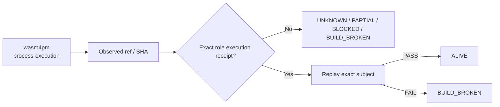

# wasm4pm — Ecosystem Status Report

> **Observed:** `2026-08-16T02:32:03.164547+00:00`  
> **Repository:** `seanchatmangpt/wasm4pm`  
> **Constitutional role:** `process-execution`  
> **Current evidence standing:** `UNKNOWN`

## Executive status

| Field | Observation |
|---|---|
| Required | `true` |
| Disposition | `REQUIRED` |
| Configured ref | `main` |
| Current SHA | `b7ebccb53b1249d45d2472f7754c997982b2f1b7` |
| Prior manifest SHA | `b7ebccb53b1249d45d2472f7754c997982b2f1b7` |
| Prior manifest standing | `UNKNOWN` |
| Prior execution receipt | `none` |
| Default branch | `main` |
| Latest commit | `Merge pull request #583 from seanchatmangpt/feat/story-pack-ggen` |
| Latest commit date | `2026-08-14T00:13:08Z` |
| Repository pushed_at | `2026-08-16T02:09:32Z` |
| Open PRs observed | `4` |
| GitHub open issues+PRs counter | `4` |
| Dependencies | `wasm4pm-compat` |

## Standing derivation

- Repository/ref is observable, but no exact current execution receipt establishes a stronger standing.

The report applies the ecosystem law: `Architecture != Execution`. A repository existing, a branch resolving, or generic CI passing does not by itself establish the role-specific `ALIVE` consequence. Exact-subject execution and a replayable receipt are the crown evidence.

## Current execution evidence

- Workflow: **Build and Optimize WASM**
- Run ID: `31922024221`
- Status: `completed`
- Conclusion: `skipped`
- Head SHA: `b7ebccb53b1249d45d2472f7754c997982b2f1b7`
- Event: `workflow_run`
- Updated: `2026-08-16T02:30:04Z`

## Open pull requests

- #587 **feat(wasm4pm): add wasm4auto second-order autonomic capability** — `agent/v26.9.1-wasm4auto-autonomic` → `main`; draft=`true`; updated `2026-08-16T02:10:02Z`.
- #586 **feat(workspace-pack): wire crate list to real cargo metadata, not a hand snapshot** — `feat/workspace-pack-cargo-metadata-sync` → `main`; draft=`true`; updated `2026-08-15T22:56:21Z`.
- #585 **Revive #558: consolidate CI workflows into ci.yml (reconciled with fmt drift + new benchmark workflows)** — `fix/pr558-revival-fmt-and-workflow-preservation` → `main`; draft=`false`; updated `2026-08-14T01:19:43Z`.
- #558 **ci: rebuild CI from Rust/WASM/TypeScript product boundaries** — `ci/errc-ground-up-20260808` → `main`; draft=`false`; updated `2026-08-08T15:32:32Z`.

## Next standing-changing receipt

Locate an existing exact-subject receipt or execute the minimum role-defining boundary to create one.

## Constitutional path

## Evidence boundary

This file is an observation report for `seanchatmangpt/wasm4pm@main`. It is not an actuation receipt and cannot itself promote the component. The strongest standing shown above is derived only from exact repository/ref identity, the previous admitted fleet manifest when its subject still matches, and current GitHub execution metadata.

